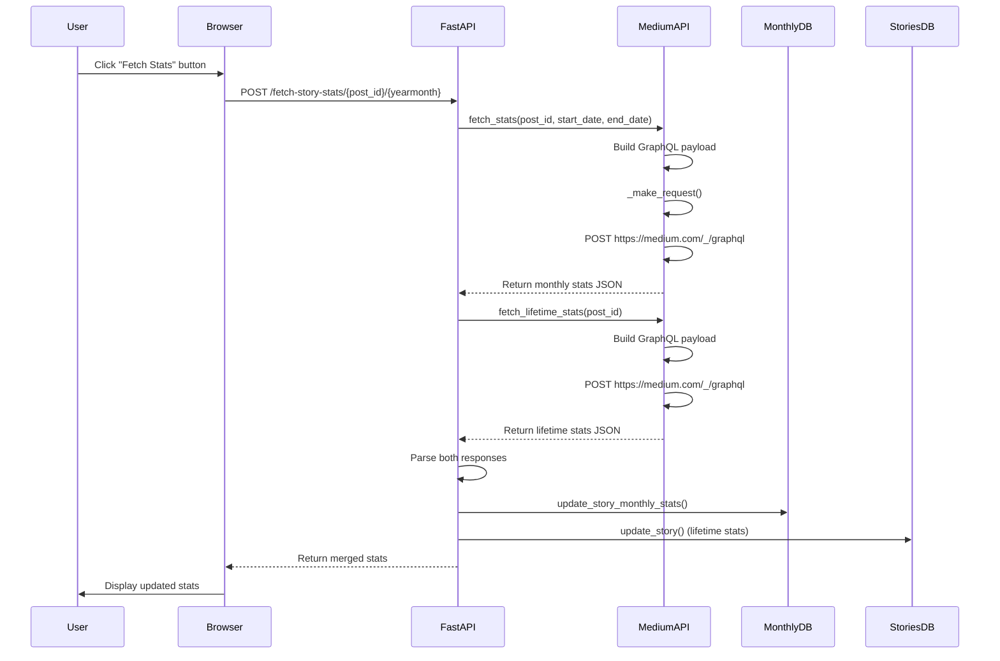
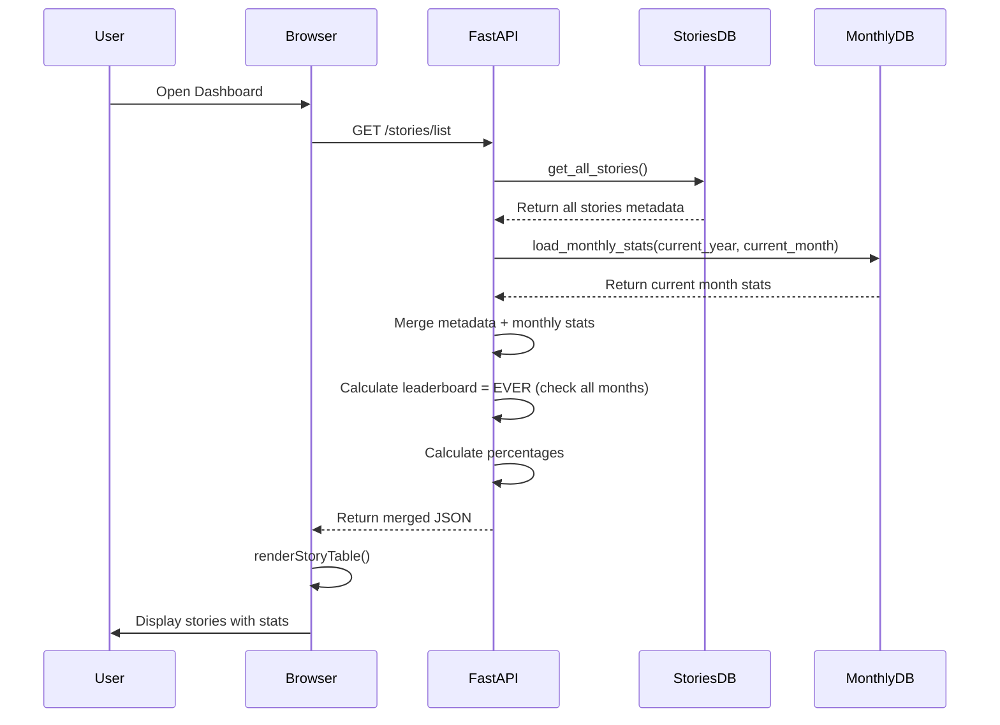
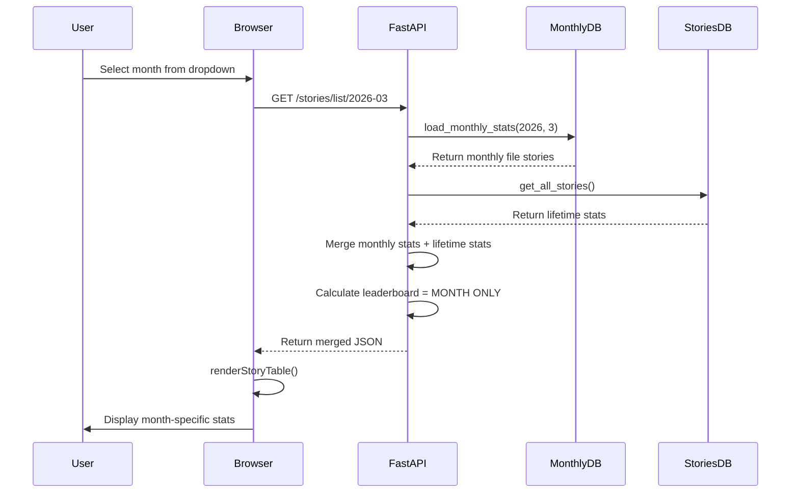
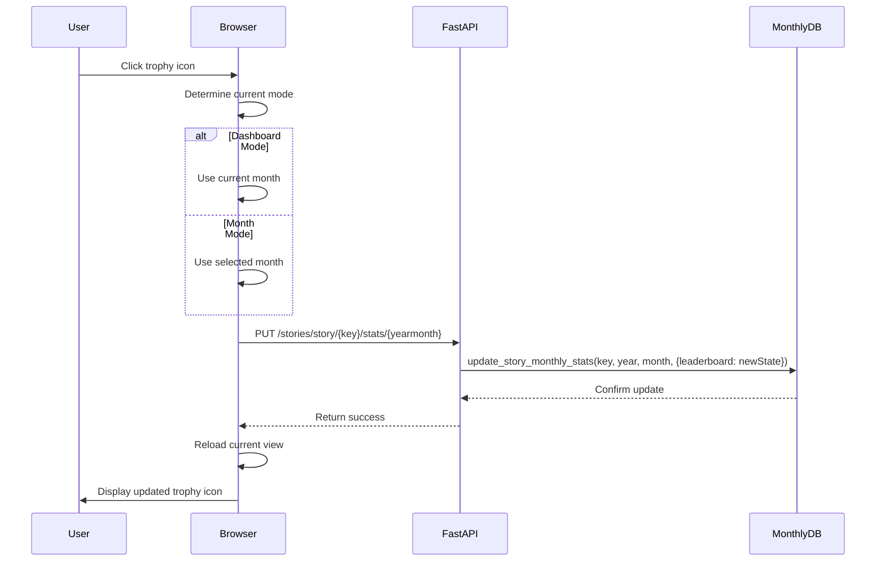
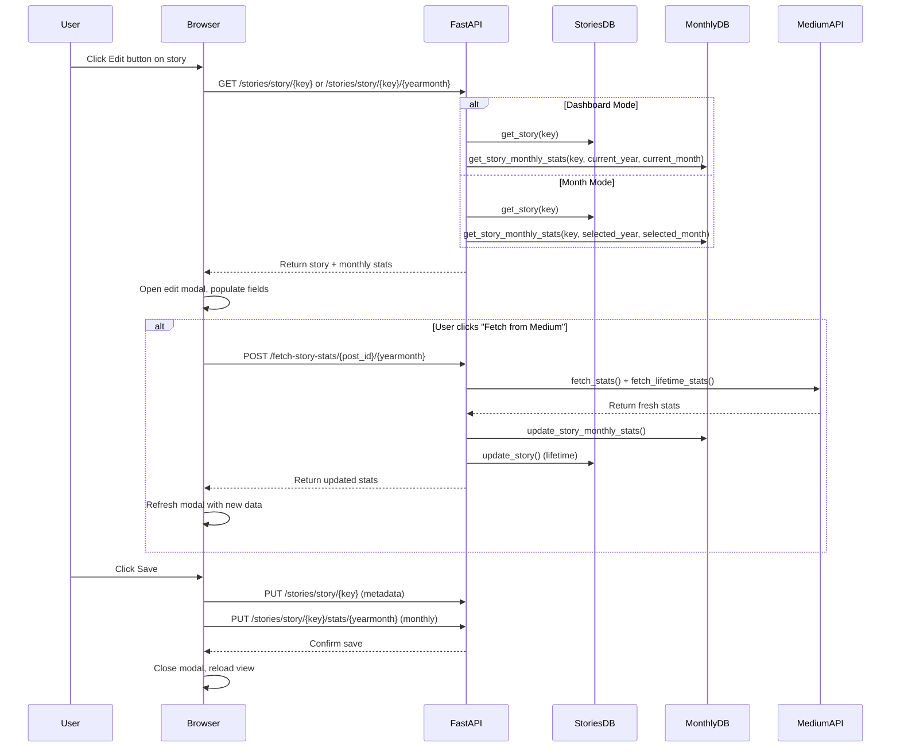
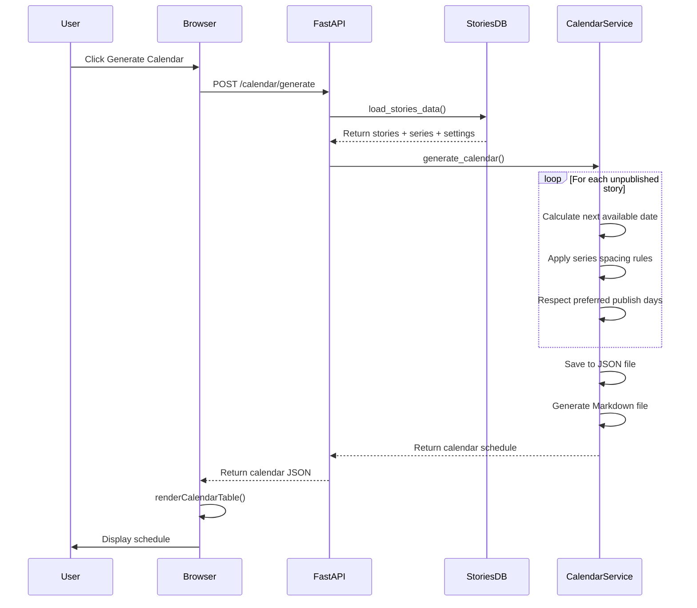
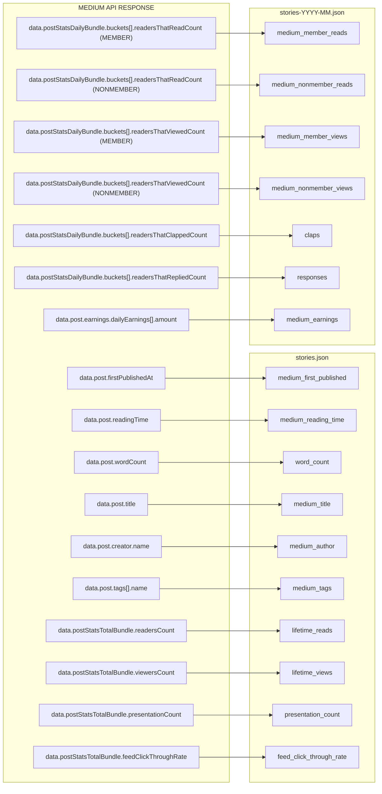
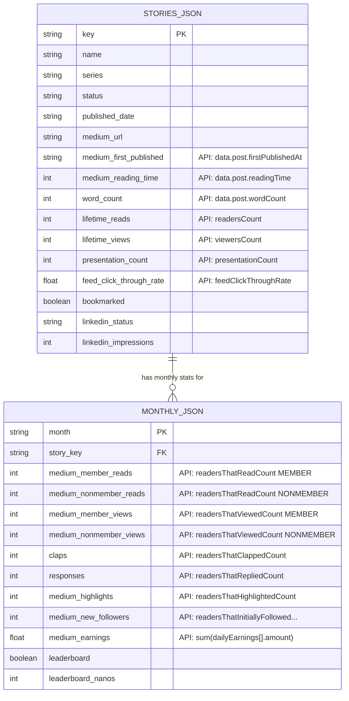
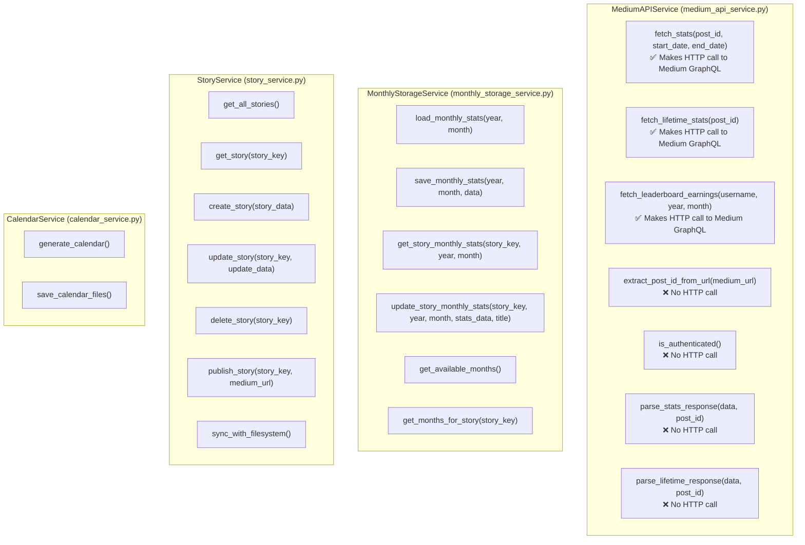
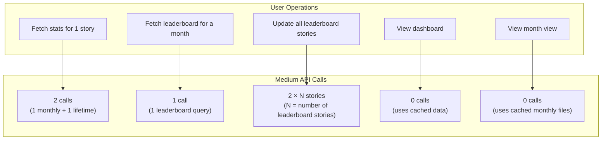

# Medium Story Manager - Complete Documentation

## Architecture Overview

```mermaid
flowchart TB
    subgraph UI["UI LAYER"]
        D[Dashboard Page]
        S[Stories Page]
        SE[Series Page]
        C[Calendar Page]
        ST[Settings Page]
    end

    subgraph API["FASTAPI ROUTERS"]
        DR[Dashboard Router]
        SR[Stories Router]
        SER[Series Router]
        CR[Calendar Router]
        STR[Settings Router]
    end

    subgraph SERVICES["SERVICES LAYER"]
        MAS[MediumAPIService<br/>- fetch_stats()<br/>- fetch_lifetime_stats()<br/>- fetch_leaderboard()]
        MSS[MonthlyStorageService<br/>- load_monthly()<br/>- save_monthly()<br/>- update_stats()]
        SS[StoryService<br/>- get_all_stories()<br/>- update_story()<br/>- sync_filesystem()]
        CS[CalendarService<br/>- generate_calendar()<br/>- save_calendar_files()]
    end

    subgraph STORAGE["DATA STORAGE"]
        SJ[stories.json<br/>- Story metadata<br/>- Lifetime stats<br/>- LinkedIn marketing]
        MJ[stories-YYYY-MM.json<br/>- Monthly stats<br/>- Leaderboard flags<br/>- Monthly earnings]
    end

    subgraph EXTERNAL["EXTERNAL API"]
        MA[Medium GraphQL API<br/>https://medium.com/_/graphql]
    end

    UI --> API
    API --> SERVICES
    SERVICES --> STORAGE
    SERVICES --> EXTERNAL
```

---

## Complete Data Flow Diagram

```mermaid
flowchart LR
    subgraph USER["USER ACTION"]
        U1[Click Fetch Stats]
        U2[Open Dashboard]
        U3[Select Month View]
        U4[Toggle Leaderboard]
    end

    subgraph BACKEND["BACKEND PROCESSING"]
        direction TB
        B1[POST /fetch-story-stats/{post_id}/{yearmonth}]
        B2[GET /stories/list]
        B3[GET /stories/list/{yearmonth}]
        B4[PUT /stories/story/{key}/stats/{yearmonth}]
    end

    subgraph API_CALLS["MEDIUM API CALLS"]
        M1[fetch_stats()<br/>useStatsPostNewChartDataQuery]
        M2[fetch_lifetime_stats()<br/>StatsPostFunnelQuery]
        M3[fetch_leaderboard_earnings()<br/>StoryEarningsQuery]
    end

    subgraph DATABASE["DATABASE"]
        DB1[(stories.json)]
        DB2[(stories-YYYY-MM.json)]
    end

    U1 --> B1
    B1 --> M1
    B1 --> M2
    M1 --> DB2
    M2 --> DB1

    U2 --> B2
    B2 --> DB1
    B2 --> DB2

    U3 --> B3
    B3 --> DB2
    B3 --> DB1

    U4 --> B4
    B4 --> DB2
```

---

## Sequence Diagrams

### Monthly Stats Fetch Flow



### Dashboard View Flow



### Month View Flow



### Leaderboard Toggle Flow



### Edit Modal Flow



### Calendar Generation Flow



---

## REST API Endpoints with curl Examples

### Stories Endpoints

| Method | Endpoint | Description | curl Example |
|--------|----------|-------------|--------------|
| GET | `/api/stories/list` | Dashboard view | `curl -X GET "http://localhost:8000/api/stories/list" \| jq '.'` |
| GET | `/api/stories/list/2026-03` | Month view | `curl -X GET "http://localhost:8000/api/stories/list/2026-03" \| jq '.'` |
| GET | `/api/stories/story/{key}/stats` | All monthly stats for a story | `curl -X GET "http://localhost:8000/api/stories/story/Miscellaneous/My%20Story/stats" \| jq '.'` |
| GET | `/api/stories/story/{key}/2026-03` | Story + specific month stats | `curl -X GET "http://localhost:8000/api/stories/story/Miscellaneous/My%20Story/2026-03" \| jq '.'` |
| GET | `/api/stories/story/{key}` | Story + current month stats | `curl -X GET "http://localhost:8000/api/stories/story/Miscellaneous/My%20Story" \| jq '.'` |
| PUT | `/api/stories/story/{key}` | Update story metadata | `curl -X PUT "http://localhost:8000/api/stories/story/Miscellaneous/My%20Story" -H "Content-Type: application/json" -d '{"status":"Published"}' \| jq '.'` |
| PUT | `/api/stories/story/{key}/stats/2026-03` | Update monthly stats | `curl -X PUT "http://localhost:8000/api/stories/story/Miscellaneous/My%20Story/stats/2026-03" -H "Content-Type: application/json" -d '{"member_reads":450,"claps":89}' \| jq '.'` |
| POST | `/api/stories/story` | Create new story | `curl -X POST "http://localhost:8000/api/stories/story" -H "Content-Type: application/json" -d '{"name":"New Story"}' \| jq '.'` |
| DELETE | `/api/stories/story/{key}` | Delete story | `curl -X DELETE "http://localhost:8000/api/stories/story/Miscellaneous/My%20Story" \| jq '.'` |
| POST | `/api/stories/story/{key}/publish` | Mark as published | `curl -X POST "http://localhost:8000/api/stories/story/Miscellaneous/My%20Story/publish" -d '{"medium_url":"https://..."}' \| jq '.'` |
| POST | `/api/stories/sync` | Sync filesystem | `curl -X POST "http://localhost:8000/api/stories/sync" \| jq '.'` |
| GET | `/api/stories/months` | Get available months | `curl -X GET "http://localhost:8000/api/stories/months" \| jq '.'` |
| GET | `/api/stories/leaderboard-status` | Get stories that ever had leaderboard | `curl -X GET "http://localhost:8000/api/stories/leaderboard-status" \| jq '.'` |
| POST | `/api/stories/fetch-story-stats/{post_id}/2026-03` | Fetch stats from Medium | `curl -X POST "http://localhost:8000/api/stories/fetch-story-stats/78cb972195da/2026-03" \| jq '.'` |
| POST | `/api/stories/fetch-leaderboard-stats/2026-03` | Import leaderboard data | `curl -X POST "http://localhost:8000/api/stories/fetch-leaderboard-stats/2026-03" \| jq '.'` |

### Series Endpoints

| Method | Endpoint | Description | curl Example |
|--------|----------|-------------|--------------|
| GET | `/api/series/` | List all series | `curl -X GET "http://localhost:8000/api/series/" \| jq '.'` |
| POST | `/api/series/` | Create series | `curl -X POST "http://localhost:8000/api/series/" -H "Content-Type: application/json" -d '{"name":"Python","spacing_days":7}' \| jq '.'` |
| PUT | `/api/series/Python` | Update series | `curl -X PUT "http://localhost:8000/api/series/Python" -H "Content-Type: application/json" -d '{"spacing_days":10}' \| jq '.'` |
| DELETE | `/api/series/Python` | Delete series | `curl -X DELETE "http://localhost:8000/api/series/Python" \| jq '.'` |

### Calendar Endpoints

| Method | Endpoint | Description | curl Example |
|--------|----------|-------------|--------------|
| GET | `/api/calendar/` | Get publishing calendar | `curl -X GET "http://localhost:8000/api/calendar/" \| jq '.'` |
| POST | `/api/calendar/generate` | Generate calendar | `curl -X POST "http://localhost:8000/api/calendar/generate" \| jq '.'` |

### Settings Endpoints

| Method | Endpoint | Description | curl Example |
|--------|----------|-------------|--------------|
| GET | `/api/settings/` | Get settings | `curl -X GET "http://localhost:8000/api/settings/" \| jq '.'` |
| PUT | `/api/settings/calendar` | Update calendar settings | `curl -X PUT "http://localhost:8000/api/settings/calendar" -H "Content-Type: application/json" -d '{"stories_per_week":4}' \| jq '.'` |
| GET | `/api/settings/stories-root` | Get stories root | `curl -X GET "http://localhost:8000/api/settings/stories-root" \| jq '.'` |

---

## Medium API to Database Field Mapping



---

## Database Schema



### stories.json Structure

```json
{
  "version": "1.0",
  "last_updated": "2026-04-06T12:00:00",
  "stories": {
    "python/advanced-tips": {
      "name": "Advanced Python Tips",
      "series": "Python",
      "status": "Published",
      "published_date": "2026-03-15",
      "medium_url": "https://medium.com/@username/post-title-123abc",
      "medium_first_published": "2026-03-15T10:00:00Z",
      "medium_reading_time": 8,
      "word_count": 1200,
      "lifetime_reads": 5234,
      "lifetime_views": 18750,
      "presentation_count": 5,
      "feed_click_through_rate": 12.8,
      "bookmarked": false,
      "linkedin_status": "posted",
      "linkedin_impressions": 1500
    }
  }
}
```

### stories-2026-03.json Structure

```json
{
  "month": "2026-03",
  "last_updated": "2026-04-06T12:00:00",
  "stories": {
    "python/advanced-tips": {
      "medium_member_reads": 300,
      "medium_nonmember_reads": 200,
      "medium_member_views": 800,
      "medium_nonmember_views": 500,
      "claps": 45,
      "responses": 8,
      "medium_highlights": 12,
      "medium_new_followers": 3,
      "medium_earnings": 12.50,
      "leaderboard": true,
      "leaderboard_nanos": 1250000000
    }
  }
}
```

---

## Service Layer Methods



---

## Total Medium API Calls per Operation



| Operation | API Calls | Details |
|-----------|-----------|---------|
| Fetch stats for 1 story | **2** | 1 monthly + 1 lifetime |
| Fetch leaderboard for a month | **1** | 1 leaderboard query |
| Update all leaderboard stories | **2 × N** | N = number of leaderboard stories |
| View dashboard | **0** | Uses cached database data |
| View month view | **0** | Uses cached monthly files |

---

## Medium API Details

### GraphQL Endpoint
```
POST https://medium.com/_/graphql
```

### API Call 1: Monthly Stats

| Property | Value |
|----------|-------|
| **Operation Name** | `useStatsPostNewChartDataQuery` |
| **Purpose** | Fetch daily breakdown of stats for a specific month |
| **Input Parameters** | `postId`, `startAt`, `endAt` |
| **Method in Code** | `MediumAPIService.fetch_stats()` |
| **Rate Limit** | 0.5 second delay between calls |

**curl Example:**
```bash
# This is called internally by the backend, not directly
curl -X POST "http://localhost:8000/api/stories/fetch-story-stats/78cb972195da/2026-03"
```

### API Call 2: Lifetime Stats

| Property | Value |
|----------|-------|
| **Operation Name** | `StatsPostFunnelQuery` |
| **Purpose** | Fetch lifetime aggregate stats for a story |
| **Input Parameters** | `postId` |
| **Method in Code** | `MediumAPIService.fetch_lifetime_stats()` |
| **Rate Limit** | 0.5 second delay between calls |

### API Call 3: Leaderboard Earnings

| Property | Value |
|----------|-------|
| **Operation Name** | `StoryEarningsQuery` |
| **Purpose** | Fetch monthly earnings for leaderboard |
| **Input Parameters** | `username`, `startAt`, `endAt`, `first`, `after` |
| **Method in Code** | `MediumAPIService.fetch_leaderboard_earnings()` |
| **Rate Limit** | 0.5 second delay between calls |

**curl Example:**
```bash
curl -X POST "http://localhost:8000/api/stories/fetch-leaderboard-stats/2026-03"
```

---

## Debug Mode

Enable debug mode to see pretty-printed API requests/responses in console:

```bash
export MEDIUM_API_DEBUG=true
uvicorn app.main:app --reload
```

Or in Python:
```python
from app.services.medium_api_service import set_debug_mode
set_debug_mode(True)
```

**Debug output includes:**
- Request headers and payloads
- Response bodies (full JSON)
- Parsed summaries for monthly and lifetime stats
- Extracted post IDs from URLs
- Daily breakdown for monthly stats

---

## Field Source Summary

| Database Field | Source |
|----------------|--------|
| `medium_first_published` | API: `data.post.firstPublishedAt` |
| `medium_reading_time` | API: `data.post.readingTime` |
| `word_count` | API: `data.post.wordCount` |
| `medium_title` | API: `data.post.title` |
| `medium_author` | API: `data.post.creator.name` |
| `medium_tags` | API: `data.post.tags[].name` |
| `medium_member_reads` | API: `readersThatReadCount` (MEMBER) |
| `medium_member_views` | API: `readersThatViewedCount` (MEMBER) |
| `medium_nonmember_reads` | API: `readersThatReadCount` (NONMEMBER) |
| `medium_nonmember_views` | API: `readersThatViewedCount` (NONMEMBER) |
| `claps` | API: `readersThatClappedCount` |
| `responses` | API: `readersThatRepliedCount` |
| `medium_highlights` | API: `readersThatHighlightedCount` |
| `medium_new_followers` | API: `readersThatInitiallyFollowedAuthorFromThisPostCount` |
| `medium_earnings` | API: `sum(data.post.earnings.dailyEarnings[].amount)` |
| `lifetime_reads` | API: `data.postStatsTotalBundle.readersCount` |
| `lifetime_views` | API: `data.postStatsTotalBundle.viewersCount` |
| `presentation_count` | API: `data.postStatsTotalBundle.presentationCount` |
| `feed_click_through_rate` | API: `data.postStatsTotalBundle.feedClickThroughRate` |
| `bookmarks` | API: `data.post.distribution.totalBookmarkCount` |
| `leaderboard` | User input (UI toggle) |
| `leaderboard_nanos` | User input |
| `linkedin_*` | User input |
| `bookmarked` | User input |
| `status` | User input |
| `series` | User input |
| `tags` | User input |
| `notes` | User input |