# Story Manager - Technical Content Management System

[](https://github.com/yourusername/story-manager/actions/workflows/ci.yml)
[](https://github.com/yourusername/story-manager/actions/workflows/docker-build.yml)
[](https://github.com/yourusername/story-manager/actions/workflows/cd.yml)
[](https://codecov.io/gh/yourusername/story-manager)
[](https://hub.docker.com/r/yourusername/story-manager)

A professional content management system for technical writers and developers to manage stories, series, and publishing schedules. Built with FastAPI and designed for writers with large content libraries (like the 71-story, 11-series operation described in this project).

---

## Table of Contents

- [Features](#features)
- [Quick Start](#quick-start)
- [Architecture](#architecture)
- [Installation](#installation)
  - [Docker (Recommended)](#docker-recommended)
  - [Local Development](#local-development)
- [Configuration](#configuration)
- [Usage](#usage)
  - [Web Dashboard](#web-dashboard)
  - [API Endpoints](#api-endpoints)
- [Content Management](#content-management)
  - [Story Structure](#story-structure)
  - [Series Organization](#series-organization)
- [Publishing Calendar](#publishing-calendar)
- [CI/CD Pipeline](#cicd-pipeline)
- [Deployment](#deployment)
- [Development](#development)
- [Troubleshooting](#troubleshooting)
- [License](#license)

---

## Features

| Feature | Description |
|---------|-------------|
| 📚 **Story Management** | Create, read, update, delete, and publish stories with full metadata |
| 📁 **Series Organization** | Group stories into series with configurable spacing between parts |
| 📅 **Publishing Calendar** | Auto-generate optimized publishing schedules based on series spacing and weekly cadence |
| 🔄 **Filesystem Sync** | Automatically discover new markdown files and sync with JSON database |
| ⚙️ **Configurable Settings** | Set default series spacing, stories per week, preferred publishing days |
| 🎨 **Web Dashboard** | Clean Bootstrap-based UI with sidebar navigation and real-time updates |
| 🔌 **REST API** | Full CRUD operations for programmatic access with OpenAPI documentation |
| 🐳 **Docker Support** | Development with hot reload and production-ready containers |
| 🔒 **Security Scanning** | Trivy, Bandit, and CodeQL integration in CI/CD |
| 📊 **Analytics Ready** | Track story performance, read times, and publishing metrics |

---

## Quick Start

### Docker (Fastest)

```bash
# Clone the repository
git clone https://github.com/yourusername/story-manager.git
cd story-manager

# Copy environment configuration
cp .env.docker .env

# Edit .env with your stories directory path
# STORIES_ROOT=/path/to/your/stories

# Start the application
docker-compose up story-manager-dev

# Open your browser to http://localhost:8000
```

### Local Development

```bash
# Create virtual environment
python3 -m venv venv
source venv/bin/activate  # On Windows: venv\Scripts\activate

# Install dependencies
pip install -r requirements.txt

# Copy and configure environment
cp .env.example .env

# Run the application
python run.py
```

---

## Architecture

The system follows a clean architecture pattern with clear separation of concerns between presentation, business logic, and data persistence.

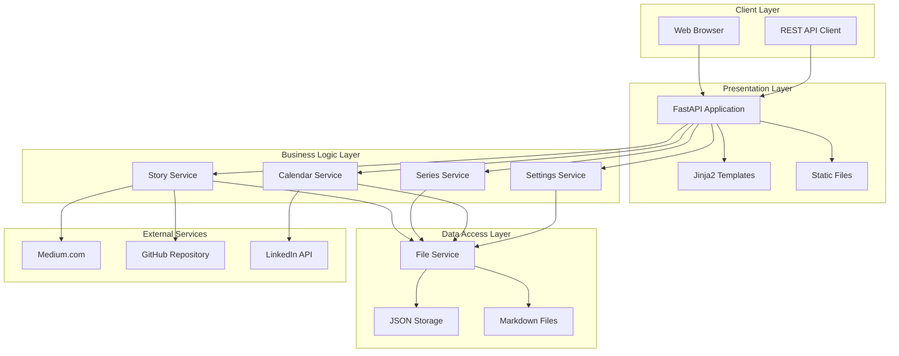

### Docker Container Architecture

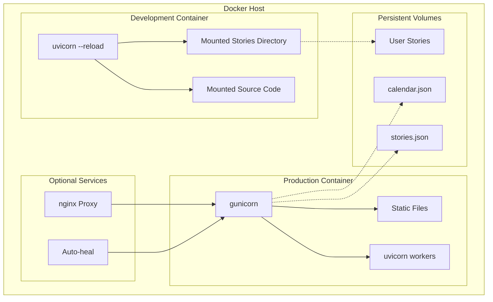

### Data Flow

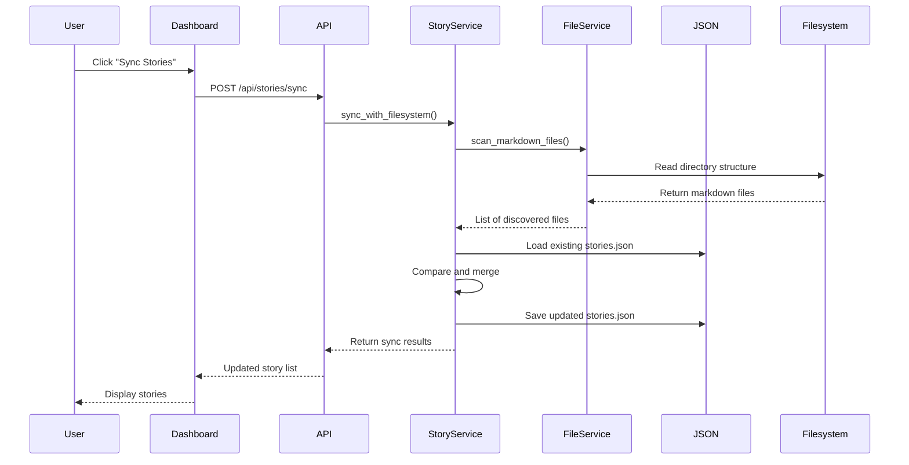

### Publishing Calendar Generation

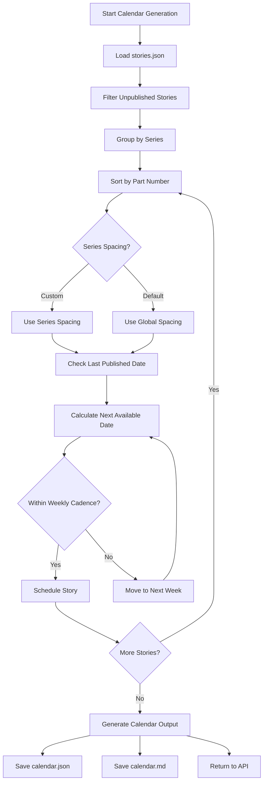

### CI/CD Pipeline

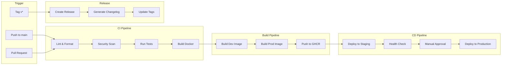

### Project Structure

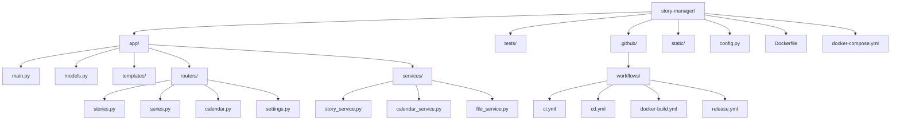

### Technology Stack

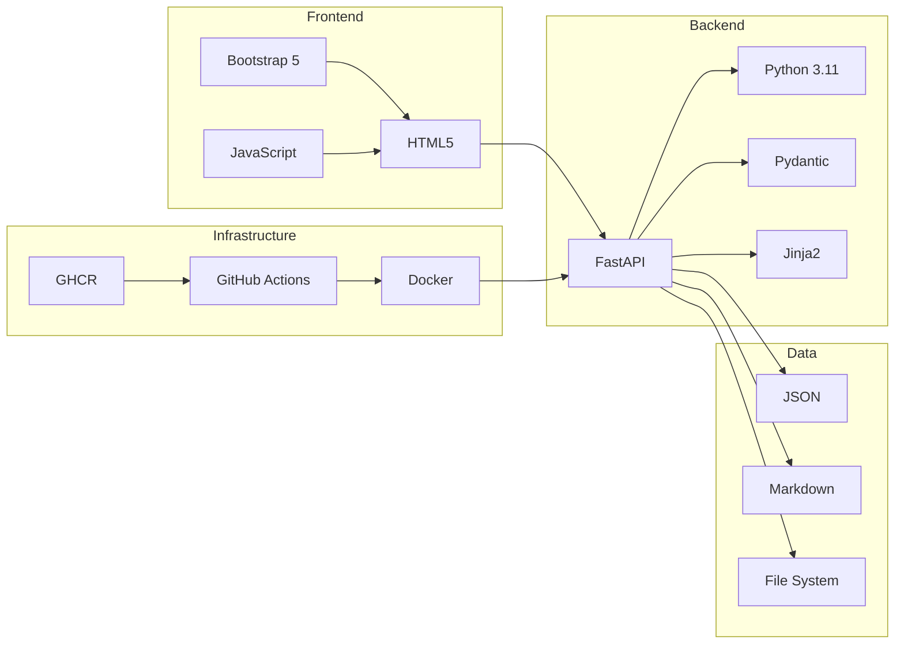

---

## Installation

### Docker (Recommended)

#### Prerequisites

- Docker Desktop 20.10+ or Docker Engine + Docker Compose
- Git (optional)

#### Step-by-Step

```bash
# 1. Clone the repository
git clone https://github.com/yourusername/story-manager.git
cd story-manager

# 2. Create environment configuration
cp .env.docker .env

# 3. Edit .env to set your stories directory
#    STORIES_ROOT=/absolute/path/to/your/stories

# 4. Create stories directory if needed
mkdir -p /path/to/your/stories

# 5. Start the application
docker-compose up story-manager-dev

# 6. Open browser to http://localhost:8000
```

#### Docker Commands

| Command | Description |
|---------|-------------|
| `docker-compose up` | Start containers (foreground) |
| `docker-compose up -d` | Start containers (background) |
| `docker-compose down` | Stop and remove containers |
| `docker-compose logs -f` | View live logs |
| `docker-compose exec story-manager-dev /bin/bash` | Open shell in container |
| `docker-compose build` | Rebuild images |
| `docker-compose down -v` | Remove containers and volumes |

### Local Development

#### Prerequisites

- Python 3.9 or higher
- pip

#### Step-by-Step

```bash
# 1. Clone the repository
git clone https://github.com/yourusername/story-manager.git
cd story-manager

# 2. Create and activate virtual environment
python3 -m venv venv
source venv/bin/activate  # On Windows: venv\Scripts\activate

# 3. Install dependencies
pip install --upgrade pip
pip install -r requirements.txt

# 4. Copy and configure environment
cp .env.example .env

# 5. Run the application
python run.py

# 6. Open browser to http://localhost:8000
```

---

## Configuration

### Environment Variables

| Variable | Default | Description |
|----------|---------|-------------|
| `APP_NAME` | "Story Manager" | Application display name |
| `DEBUG` | false | Enable debug mode (auto-reload) |
| `STORIES_ROOT` | "./stories" | Path to stories directory |
| `DEFAULT_SERIES_SPACING_DAYS` | 7 | Default days between series parts |
| `DEFAULT_STORIES_PER_WEEK` | 3 | Maximum stories per week |
| `PREFERRED_PUBLISH_DAYS` | ["Monday","Tuesday","Wednesday","Thursday"] | Preferred days to publish |

### Calendar Settings (in stories.json)

```json
{
  "calendar_settings": {
    "series_spacing_days": 7,
    "stories_per_week": 4,
    "preferred_publish_days": ["Monday", "Tuesday", "Wednesday", "Thursday"],
    "start_date": "2026-04-01"
  }
}
```

---

## Usage

### Web Dashboard

Once running, access the dashboard at `http://localhost:8000`

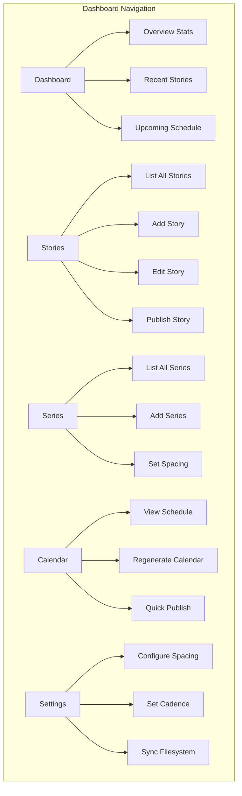

### API Endpoints

Interactive API documentation available at:
- **Swagger UI**: `http://localhost:8000/docs`
- **ReDoc**: `http://localhost:8000/redoc`

| Method | Endpoint | Description |
|--------|----------|-------------|
| POST | `/api/stories/sync` | Sync with filesystem |
| GET | `/api/stories/` | List all stories |
| GET | `/api/stories/{key}` | Get a specific story |
| POST | `/api/stories/` | Create a new story |
| PUT | `/api/stories/{key}` | Update a story |
| POST | `/api/stories/{key}/publish` | Mark story as published |
| DELETE | `/api/stories/{key}` | Delete a story |
| GET | `/api/series/` | List all series |
| POST | `/api/series/` | Create a series |
| GET | `/api/calendar/` | Get publishing calendar |
| POST | `/api/calendar/generate` | Generate calendar |
| GET | `/api/settings/` | Get settings |
| PUT | `/api/settings/calendar` | Update calendar settings |

---

## Content Management

### Story Structure

Stories are markdown files organized in folders by series:

```
stories/
├── AI Engineering/
│   ├── AI Agent Engineering 1 - Foundation.md
│   ├── AI Agent Engineering 2 - Building Your First Agent.md
│   └── ...
├── SOLID Principles/
│   ├── SOLID Principles Part 1 - Single Responsibility.md
│   └── ...
├── GitHub Copilot/
│   └── GitHub Copilot The AI-Powered Development Ecosystem.md
└── standalone-story.md
```

### Series Organization

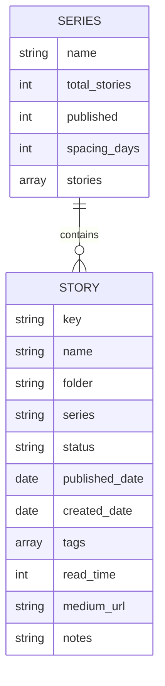

---

## Publishing Calendar

The calendar generator automatically schedules unpublished stories based on:

1. **Series spacing** - Ensures adequate time between parts of the same series
2. **Weekly cadence** - Limits stories per week to maintain quality
3. **Preferred days** - Schedules on your chosen publishing days
4. **Part ordering** - Respects story order within series

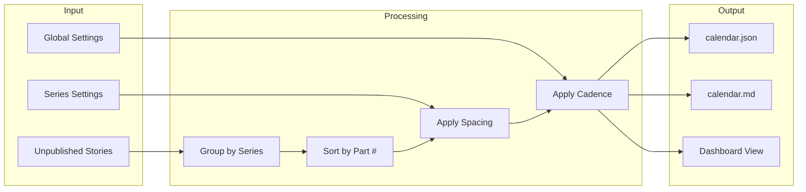

---

## CI/CD Pipeline

This project uses GitHub Actions for continuous integration and deployment.

### Pipeline Stages

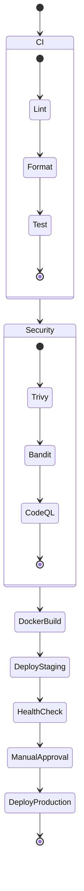

### GitHub Actions Workflows

| Workflow | Trigger | Purpose |
|----------|---------|---------|
| `ci.yml` | Push, PR | Lint, test, security scan |
| `docker-build.yml` | Push, Tag | Build and push Docker images |
| `cd.yml` | Main, Tag | Deploy to staging/production |
| `release.yml` | Tag | Create GitHub Release |

### Badges

[](https://github.com/yourusername/story-manager/actions/workflows/ci.yml)
[](https://github.com/yourusername/story-manager/actions/workflows/docker-build.yml)
[](https://github.com/yourusername/story-manager/actions/workflows/cd.yml)

---

## Deployment

### Docker Compose Production

```bash
# Pull latest image
docker pull ghcr.io/yourusername/story-manager:latest

# Start production stack
docker-compose -f docker-compose.production.yml up -d

# View logs
docker-compose logs -f story-manager-prod
```

### Manual Deployment

```bash
# Build production image
docker build --target production -t story-manager:prod .

# Run container
docker run -d \
  --name story-manager \
  -p 8000:8000 \
  -v /opt/stories:/app/stories \
  -v story-manager-data:/app/data \
  -e DEBUG=false \
  story-manager:prod
```

### Backup and Restore

```bash
# Backup JSON data
docker run --rm \
  -v story-manager-data:/data \
  -v $(pwd):/backup \
  alpine tar czf /backup/story-manager-backup.tar.gz -C /data .

# Restore from backup
docker run --rm \
  -v story-manager-data:/data \
  -v $(pwd):/backup \
  alpine tar xzf /backup/story-manager-backup.tar.gz -C /data
```

---

## Development

### Running Tests

```bash
# Install test dependencies
pip install pytest pytest-cov pytest-asyncio httpx

# Run all tests
pytest tests/ -v

# Run with coverage
pytest tests/ -v --cov=app --cov-report=html

# Run specific test file
pytest tests/test_stories.py -v
```

### Code Quality

```bash
# Format code
black app/ --line-length 100

# Lint code
flake8 app/ --count --statistics

# Type checking
mypy app/ --ignore-missing-imports

# Security scan
bandit -r app/ -f json -o bandit-results.json
```

### Using Makefile

```bash
make help      # Show available commands
make dev       # Start development mode
make prod      # Start production mode
make build     # Build Docker images
make logs      # View logs
make shell     # Open shell in container
make clean     # Clean up containers and volumes
make test      # Run tests
make lint      # Run linters
```

---

## Troubleshooting

### Docker Issues

| Problem | Solution |
|---------|----------|
| Port already in use | Change port in `docker-compose.yml` |
| Permission denied | `sudo chmod 666 /var/run/docker.sock` |
| Stories not found | Check `STORIES_ROOT` in `.env` |
| Hot reload not working | Use `story-manager-dev` service |

### Common Errors

```bash
# Error: Module not found
pip install -r requirements.txt

# Error: stories.json not found
touch stories.json

# Error: Cannot connect to Docker
eval $(minikube docker-env)  # For minikube
```

### View Logs

```bash
# Docker logs
docker-compose logs -f story-manager-dev

# Application logs (if running locally)
tail -f app.log
```

---

## License

MIT License - Use freely for personal and commercial projects.

---

## Acknowledgments

Built for technical writers who manage large content libraries across multiple series and platforms. Special thanks to the FastAPI and Docker communities.

---

*Last updated: 2026-03-28*