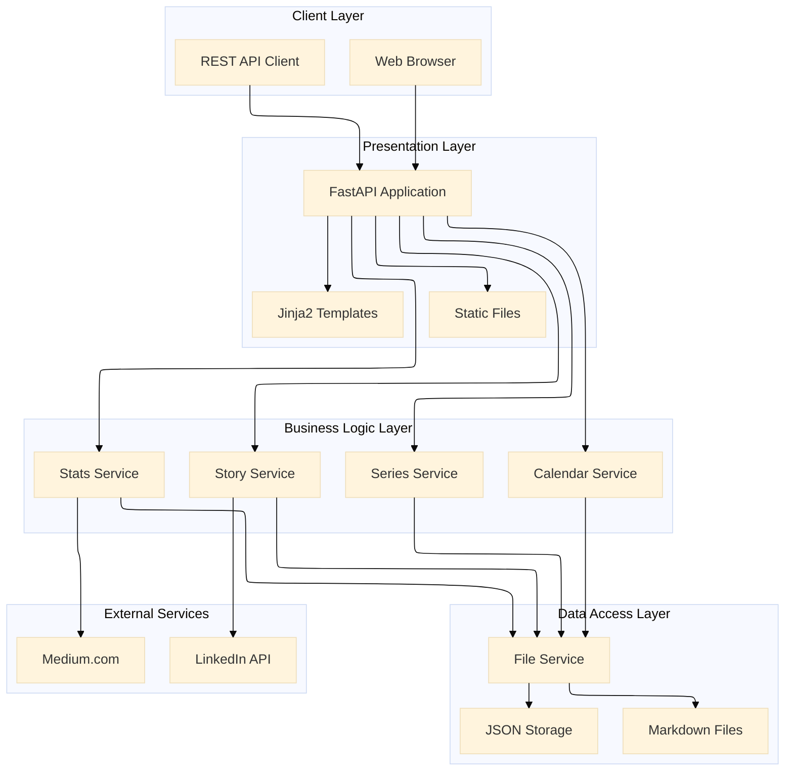
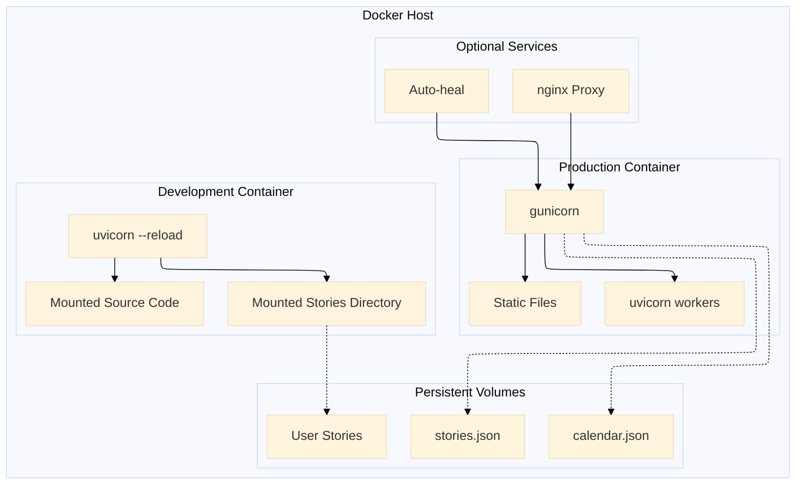
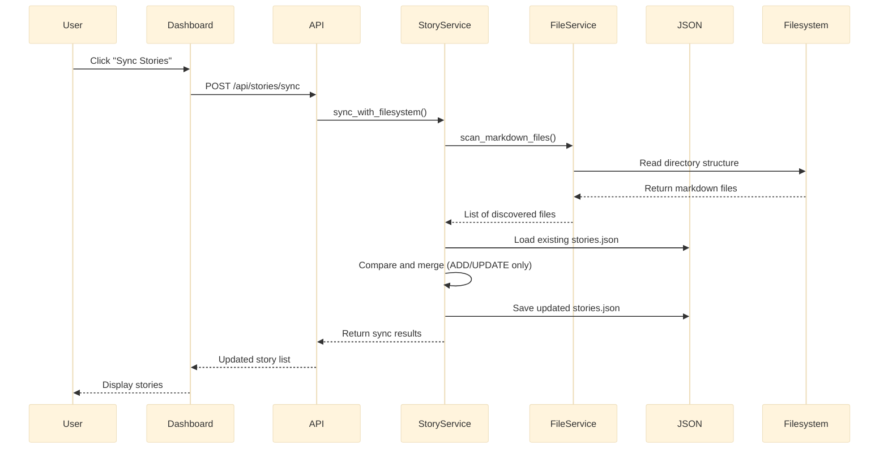
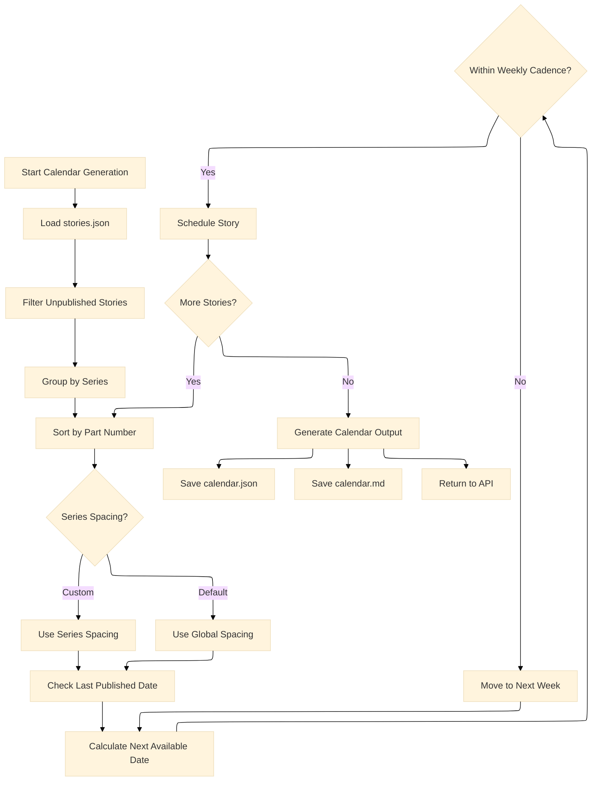
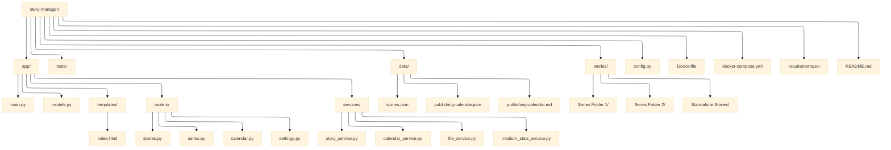
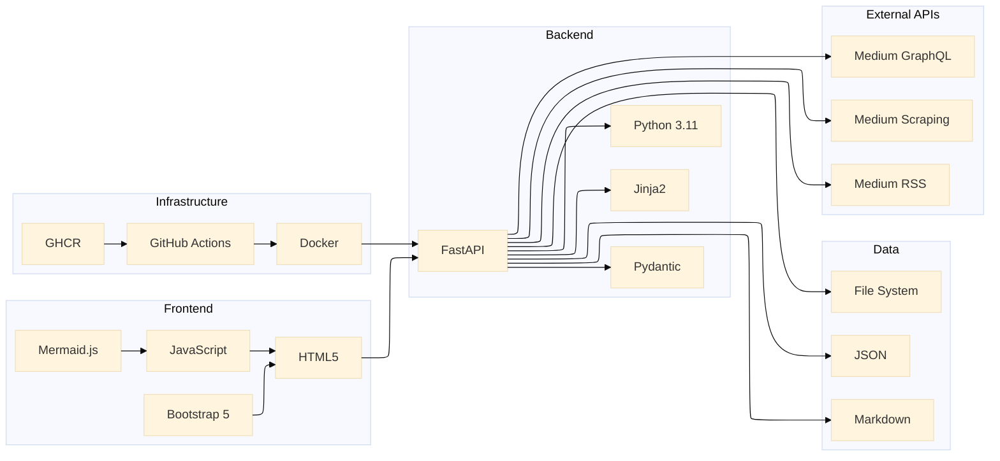
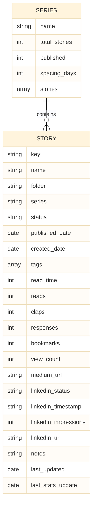
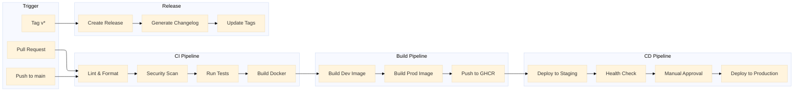

# Story Manager - Technical Content Management System

[](https://www.python.org/)
[](https://fastapi.tiangolo.com/)
[](https://www.docker.com/)

A professional content management system for technical writers and developers to manage stories, series, publishing schedules, and track performance metrics. Built with FastAPI and designed for writers with large content libraries.

---

## Table of Contents

- [Features](#features)
- [Quick Start](#quick-start)
- [Architecture](#architecture)
- [Installation](#installation)
- [Configuration](#configuration)
- [Usage](#usage)
- [Data Management](#data-management)
- [API Documentation](#api-documentation)
- [Docker Deployment](#docker-deployment)
- [CI/CD Pipeline](#cicd-pipeline)
- [Troubleshooting](#troubleshooting)
- [License](#license)

---

## Features

| Feature | Description |
|---------|-------------|
| 📚 **Story Management** | Create, read, update, delete, and publish stories with full metadata |
| 📁 **Series Organization** | Group stories into series with configurable spacing between parts |
| 📅 **Publishing Calendar** | Auto-generate optimized publishing schedules based on series spacing and weekly cadence |
| 🔄 **Filesystem Sync** | Automatically discover new markdown files and sync with JSON database (never deletes) |
| 📊 **Medium Stats** | Fetch story statistics (claps, responses, reading time, tags) from Medium |
| 🔗 **LinkedIn Tracking** | Track LinkedIn post status, timestamp, impressions, and URL for each story |
| ⚙️ **Configurable Settings** | Set series spacing, stories per week, preferred publishing days |
| 🎨 **Web Dashboard** | Clean Bootstrap-based UI with sidebar navigation and real-time updates |
| 🔌 **REST API** | Full CRUD operations with OpenAPI documentation |
| 🐳 **Docker Support** | Development with hot reload and production-ready containers |
| 🔒 **Filter Persistence** | Maintains filters across page refreshes and actions |

---

## Quick Start

### Docker (Fastest)

```bash
# Clone the repository
git clone https://github.com/yourusername/story-manager.git
cd story-manager

# Copy environment configuration
cp .env.example .env

# Edit .env with your stories directory path
# STORIES_ROOT=/path/to/your/stories

# Start the application
docker-compose up story-manager-dev

# Open browser to http://localhost:8000
```

### Local Development

```bash
# Create virtual environment
python3 -m venv venv
source venv/bin/activate  # On Windows: venv\Scripts\activate

# Install dependencies
pip install -r requirements.txt

# Copy and configure environment
cp .env.example .env

# Run the application
python run.py
```

---

## Architecture

### System Architecture Diagram



### Docker Container Architecture



### Data Flow Diagram



### Publishing Calendar Generation



### Medium Stats Flow

```mermaid
flowchart LR
    subgraph "User Action"
        A[Click Stats Button]
        B[Click Sync All Stats]
    end
    
    subgraph "API Layer"
        C[/stats-by-url/]
        D[/sync-stats/]
        E[/{key}/sync-stats/]
    end
    
    subgraph "Service Layer"
        F[MediumStatsService]
        G[Get Story by URL]
        H[Fetch from Medium]
    end
    
    subgraph "Data Sources"
        I[Medium.com Page]
        J[Medium RSS Feed]
        K[Medium GraphQL]
    end
    
    subgraph "Storage"
        L[stories.json]
    end
    
    A --> C
    B --> D
    C --> G
    D --> F
    E --> F
    F --> H
    H --> I
    H --> J
    H --> K
    F --> L
```

### Project Structure



### Technology Stack



---

## Installation

### Prerequisites

- Python 3.9 or higher
- pip
- Git (optional)
- Docker (optional)

### Docker Installation (Recommended)

```bash
# 1. Clone the repository
git clone https://github.com/yourusername/story-manager.git
cd story-manager

# 2. Create environment configuration
cp .env.example .env

# 3. Edit .env with your stories directory path
#    STORIES_ROOT=/absolute/path/to/your/stories

# 4. Create stories directory if needed
mkdir -p /path/to/your/stories

# 5. Start the application
docker-compose up story-manager-dev

# 6. Open browser to http://localhost:8000
```

### Local Development Installation

```bash
# 1. Clone the repository
git clone https://github.com/yourusername/story-manager.git
cd story-manager

# 2. Create and activate virtual environment
python3 -m venv venv
source venv/bin/activate  # On Windows: venv\Scripts\activate

# 3. Install dependencies
pip install --upgrade pip
pip install -r requirements.txt

# 4. Copy and configure environment
cp .env.example .env

# 5. Run the application
python run.py
```

---

## Configuration

### Environment Variables

| Variable | Default | Description |
|----------|---------|-------------|
| `APP_NAME` | "Story Manager" | Application display name |
| `DEBUG` | false | Enable debug mode (auto-reload) |
| `STORIES_ROOT` | "./stories" | Path to stories directory |
| `DATA_DIR` | "./data" | Directory for JSON data files |
| `DEFAULT_SERIES_SPACING_DAYS` | 7 | Default days between series parts |
| `DEFAULT_STORIES_PER_WEEK` | 3 | Maximum stories per week |
| `PREFERRED_PUBLISH_DAYS` | ["Monday","Tuesday","Wednesday","Thursday"] | Preferred days to publish |
| `MEDIUM_SID` | (optional) | Medium session cookie for stats |
| `MEDIUM_UID` | (optional) | Medium user ID cookie for stats |

### `.env.example`

```bash
# Application Settings
APP_NAME="Story Manager"
DEBUG=true

# Stories Directory
STORIES_ROOT="./stories"

# Data Directory
DATA_DIR="./data"

# Publishing Calendar Settings
DEFAULT_SERIES_SPACING_DAYS=7
DEFAULT_STORIES_PER_WEEK=3
PREFERRED_PUBLISH_DAYS='["Monday", "Tuesday", "Wednesday", "Thursday"]'

# Medium Stats (optional - for authenticated stats)
# MEDIUM_SID="your_medium_sid_cookie"
# MEDIUM_UID="your_medium_uid_cookie"
```

---

## Usage

### Dashboard Navigation

```mermaid
---
config:
  theme: base
  layout: elk
---
graph TD
    subgraph "Dashboard Navigation"
        A[Dashboard] --> B[Overview Stats]
        A --> C[Recent Stories]
        A --> D[Upcoming Schedule]
        
        E[Stories] --> F[List All Stories]
        E --> G[Add Story]
        E --> H[Edit Story]
        E --> I[Publish Story]
        E --> J[Stats Dashboard]
        E --> K[LinkedIn Quick Actions]
        
        L[Series] --> M[List All Series]
        L --> N[Add Series]
        L --> O[Set Spacing]
        
        P[Calendar] --> Q[View Schedule]
        P --> R[Regenerate Calendar]
        P --> S[Quick Publish]
        
        T[Settings] --> U[Configure Spacing]
        T --> V[Set Cadence]
        T --> W[Sync Filesystem]
    end
```



### Story Management

**Stories Table Features:**
- Filter by status (Draft, Done, Ready, Published)
- Filter by series
- Search by story name
- Click any row to edit
- Quick actions: Publish, LinkedIn status, Stats Dashboard, Delete

**Edit Story Modal:**
- Status: Draft, Done, Ready, Published
- Created/Published dates (editable with "Today" button)
- Read time, Medium reads
- Tags
- Medium URL (required for stats)
- LinkedIn marketing: Status, timestamp, impressions, URL
- Notes

### LinkedIn Status Tracking

| Status | Icon | Description |
|--------|------|-------------|
| Not Posted | ❌ | Story not yet shared on LinkedIn |
| Scheduled | 📅 | Planned post with timestamp |
| Posted | ✅ | Shared with timestamp and optional URL |

**Quick Actions:**
- Click LinkedIn icon to mark as Posted
- Click Calendar icon to mark as Scheduled
- Click X-circle icon to clear status

### Medium Stats Dashboard

Fetches publicly available statistics from Medium:

| Stat | Availability |
|------|--------------|
| Claps | ✅ Always available |
| Responses | ✅ Always available |
| Reading time | ✅ Always available |
| Word count | ✅ Available in page source |
| Tags | ✅ Available |
| Title/Subtitle | ✅ Always available |
| Author | ✅ Always available |
| Publication | ✅ Available |
| Reads | ❌ Requires Partner Program |
| View counts | ❌ Requires Partner Program |

**To fetch stats:**
1. Add Medium URL to a story in edit mode
2. Click the stats button (graph icon) in stories table
3. Use "Refresh Stats" to fetch latest data
4. Use "Sync All Stats" to update all stories at once

### Publishing Calendar

The calendar generator automatically schedules unpublished stories based on:

1. **Series spacing** - Ensures adequate time between parts of the same series (5-14 days)
2. **Weekly cadence** - Limits stories per week (1-7)
3. **Preferred days** - Schedules on your chosen publishing days
4. **Part ordering** - Respects story order within series

---

## Data Management

### Story File Structure

Stories are markdown files organized in folders by series:

```
stories/
├── AI Engineering/
│   ├── AI Agent Engineering 1 - Foundation.md
│   ├── AI Agent Engineering 2 - Building Your First Agent.md
│   └── ...
├── SOLID Principles/
│   ├── SOLID Principles Part 1 - Single Responsibility.md
│   ├── SOLID Principles Part 2 - Open-Closed.md
│   └── ...
├── GitHub Copilot/
│   └── GitHub Copilot The AI-Powered Development Ecosystem.md
└── standalone-story.md
```

### Data Storage

| File | Purpose |
|------|---------|
| `data/stories.json` | Source of truth - all story metadata |
| `data/publishing-calendar.json` | Generated calendar data |
| `data/publishing-calendar.md` | Human-readable calendar |

### Sync Behavior

The sync operation:
- ✅ **Adds** new stories discovered in the `STORIES_ROOT` directory
- ✅ **Updates** file metadata for existing stories (path, name, folder)
- ❌ **Never deletes** stories from the database (preserves all your data even if source files are removed)

### Database Schema



---

## API Documentation

Once running, interactive API documentation is available at:

- **Swagger UI**: `http://localhost:8000/docs`
- **ReDoc**: `http://localhost:8000/redoc`

### Key Endpoints

| Method | Endpoint | Description |
|--------|----------|-------------|
| POST | `/api/stories/sync` | Sync with filesystem |
| GET | `/api/stories/` | List all stories |
| GET | `/api/stories/{key}` | Get a specific story |
| POST | `/api/stories/` | Create a new story |
| PUT | `/api/stories/{key}` | Update a story |
| POST | `/api/stories/{key}/publish` | Mark as published |
| DELETE | `/api/stories/{key}` | Delete a story |
| GET | `/api/series/` | List all series |
| POST | `/api/series/` | Create a series |
| PUT | `/api/series/{name}` | Update a series |
| DELETE | `/api/series/{name}` | Delete a series |
| GET | `/api/calendar/` | Get publishing calendar |
| POST | `/api/calendar/generate` | Generate calendar |
| GET | `/api/stories/stats-by-url` | Get Medium stats by URL |
| POST | `/api/stories/sync-stats` | Sync all Medium stats |
| POST | `/api/stories/{key}/sync-stats` | Sync stats for a single story |
| GET | `/api/stories/debug/all` | Debug: list all stories |
| GET | `/api/stories/debug/urls` | Debug: list all URLs |

---

## Docker Deployment

### Docker Commands

| Command | Description |
|---------|-------------|
| `docker-compose up` | Start containers (foreground) |
| `docker-compose up -d` | Start containers (background) |
| `docker-compose down` | Stop and remove containers |
| `docker-compose logs -f` | View live logs |
| `docker-compose exec story-manager-dev /bin/bash` | Open shell in container |
| `docker-compose build` | Rebuild images |
| `docker-compose down -v` | Remove containers and volumes |

### Production Deployment

```bash
# Build and start production containers
docker-compose up story-manager-prod -d

# With Nginx reverse proxy
docker-compose --profile with-nginx up -d
```

### Backup and Restore

```bash
# Backup JSON data
docker run --rm \
  -v story-manager-data:/data \
  -v $(pwd):/backup \
  alpine tar czf /backup/story-manager-backup.tar.gz -C /data .

# Restore from backup
docker run --rm \
  -v story-manager-data:/data \
  -v $(pwd):/backup \
  alpine tar xzf /backup/story-manager-backup.tar.gz -C /data
```

---

## CI/CD Pipeline



### GitHub Actions Workflows

| Workflow | Trigger | Purpose |
|----------|---------|---------|
| `ci.yml` | Push, PR | Lint, test, security scan |
| `docker-build.yml` | Push, Tag | Build and push Docker images |
| `cd.yml` | Main, Tag | Deploy to staging/production |
| `release.yml` | Tag | Create GitHub Release |

---

## Troubleshooting

### Common Issues

| Problem | Solution |
|---------|----------|
| Port already in use | Change port in `run.py` or `docker-compose.yml` |
| Stories not found | Check `STORIES_ROOT` in `.env` and ensure directory exists |
| Medium stats not working | Add Medium URL to story first; ensure story is public |
| LinkedIn clear not working | Use the "Clear All LinkedIn Data" button in edit modal |
| Division by zero error | Stories with 0 reads will show 0 in performance metrics |
| Sync not updating | Check file permissions on stories directory |

### View Logs

```bash
# Docker logs
docker-compose logs -f story-manager-dev

# Local logs
python run.py
```

### Debug Endpoints

```bash
# List all stories
curl "http://localhost:8000/api/stories/debug/all" | python -m json.tool

# List all stories with Medium URLs
curl "http://localhost:8000/api/stories/debug/urls" | python -m json.tool

# Find story by search term
curl "http://localhost:8000/api/stories/debug/find/github" | python -m json.tool
```

---

## Requirements

- Python 3.9+
- pip
- Docker (optional)

### Python Dependencies

```
fastapi==0.115.6
uvicorn[standard]==0.34.0
jinja2==3.1.4
python-multipart==0.0.20
pydantic==2.10.3
pydantic-settings==2.6.0
aiofiles==24.1.0
python-dotenv==1.0.1
aiohttp==3.9.5
beautifulsoup4==4.12.3
lxml==5.2.1
```

---

## License

MIT License - Use freely for personal and commercial projects.

---

## Acknowledgments

Built for technical writers who manage large content libraries across multiple series and platforms. Special thanks to the FastAPI, Bootstrap, and Docker communities.
