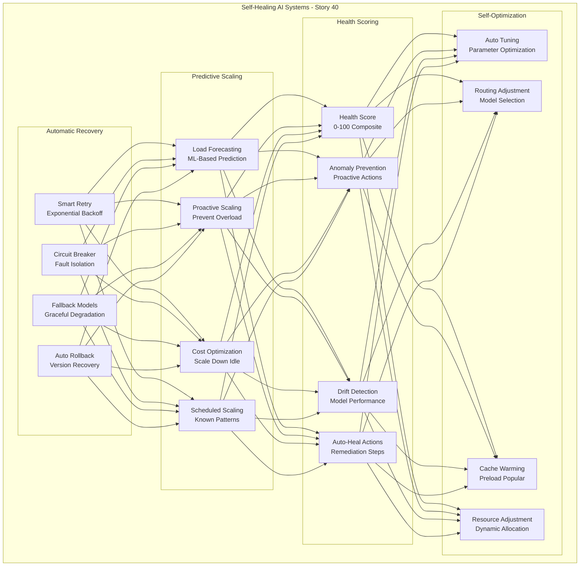
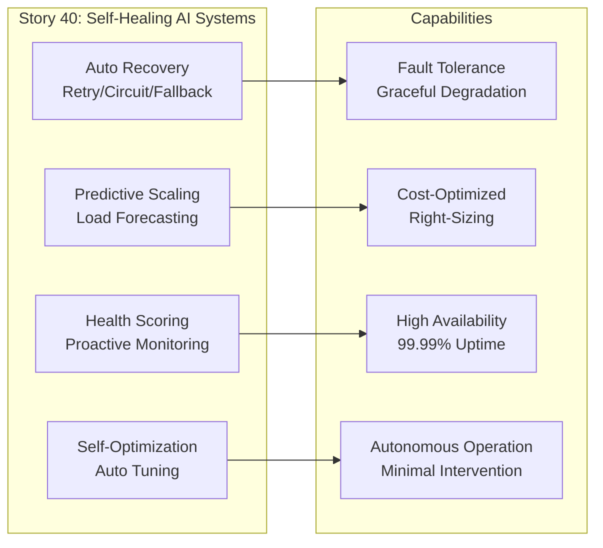

# Self-Healing AI Systems - Azure AI Foundry

#### Master production-grade self-healing AI systems—implement automatic retry with intelligent backoff, deploy fallback models for graceful degradation, enable predictive auto-scaling for workload changes, build proactive health scoring for anomaly prevention, and achieve autonomous recovery for enterprise AI infrastructure at scale

### The Complete Azure AI Foundry AI Engineer's Guide – From Models to Production-Ready AI Systems

### Introduction

The Azure AI Foundry AI Engineer's Guide series is a comprehensive journey through Microsoft's unified generative AI platform. Story 1 established the foundational understanding of Azure AI Foundry, covering platform architecture, model catalog, deployments, and cost management. Story 2 built on that foundation with production-grade prompt engineering and Prompt Flow orchestration. Story 3 focused on Retrieval-Augmented Generation (RAG) using Azure AI Search. Story 4 covered model fine-tuning and customization with LoRA/QLoRA. Story 5 covered evaluation and observability. Story 6 focused on content safety and responsible AI. Story 7 covered production deployment and scaling. Story 8 covered monitoring and alerting. Story 9 covered multi-modal AI. Story 10 covered advanced RAG optimization. Story 11 covered agentic AI with Semantic Kernel. Story 12 covered advanced fine-tuning techniques. Story 13 covered model distillation and quantization. Story 14 covered A/B testing and experimentation. Story 15 covered prompt caching and optimization. Story 16 covered Model-as-a-Service (MaaS). Story 17 covered CI/CD for generative AI. Story 18 covered multi-tenancy and isolation. Story 19 covered private networking and security. Story 20 covered compliance and data residency. Story 21 covered cost management and optimization. Story 22 covered disaster recovery and high availability. Story 23 covered auditability and lineage. Story 24 covered developer productivity. Story 25 covered enterprise chatbots. Story 26 covered code generation and assistance. Story 27 covered document processing and Q&A. Story 28 covered data-to-text generation. Story 29 covered multilingual and localization. Story 30 covered real-time AI assistants. Story 31 covered batch inference and processing. Story 32 covered synthetic data generation. Story 33 covered advanced prompt engineering. Story 34 covered retrieval optimization deep dive. Story 35 covered context management strategies. Story 36 covered advanced guardrails. Story 37 covered token and latency optimization. Story 38 covered multi-model orchestration. Story 39 covered observability deep dive. Story 40 focuses on self-healing AI systems—the final piece of the enterprise AI puzzle, enabling autonomous recovery and resilience.

All code examples reference a production AI platform, demonstrating practical implementations of self-healing capabilities.



---

# Navigation

**Azure AI Foundry Series Navigation:**

- **1.** **[Azure AI Foundry Fundamentals & Model Catalog - Azure AI Foundry](#)** 
  *Master platform foundation, model catalog navigation, first deployment, intelligent routing, and cost governance*

- **2.** **[Prompt Engineering & Prompt Flow - Azure AI Foundry](#)** 
  *Production prompt optimization, versioning, flow orchestration, variant testing, and multi-step AI workflows*

- **3.** **[RAG Implementation with Azure AI Search - Azure AI Foundry](#)** 
  *Vector indexing, hybrid search, semantic reranking, chunking strategies, and end-to-end RAG systems*

- **4.** **[Model Fine-Tuning & Customization - Azure AI Foundry](#)** 
  *LoRA, QLoRA, full fine-tuning, hyperparameter optimization, and custom model deployment*

- **5.** **[Evaluation & Observability - Azure AI Foundry](#)** 
  *Metrics tracking, custom evaluators, distributed tracing, real-time dashboards, and health monitoring*

- **6.** **[Content Safety & Responsible AI - Azure AI Foundry](#)** 
  *Prompt shields, groundedness detection, content moderation, PII redaction, and ethical AI guardrails*

- **7.** **[Model Deployment & Scaling - Azure AI Foundry](#)** 
  *Blue-green deployments, auto-scaling, traffic splitting, canary releases, and inference optimization*

- **8.** **[Monitoring & Alerting - Azure AI Foundry](#)** 
  *SLI/SLO tracking, anomaly detection, incident management, and alerting*

- **9.** **[Multi-Modal AI with Azure AI Foundry - Azure AI Foundry](#)** 
  *Vision-language models, image generation, document intelligence, cross-modal reasoning, and multi-modal RAG*

- **10.** **[Advanced RAG Optimization - Azure AI Foundry](#)** 
  *Query rewriting, hybrid search tuning, semantic reranking, index CRUD operations, and self-improving RAG*

- **11.** **[Agentic AI with Semantic Kernel - Azure AI Foundry](#)** 
  *Function calling, planners, multi-agent systems, and enterprise automation*

- **12.** **[Fine-Tuning Deep Dive - Azure AI Foundry](#)** 
  *P-tuning, prefix tuning, distributed training, advanced HPO, and production fine-tuning pipelines*

- **13.** **[Model Distillation & Quantization - Azure AI Foundry](#)** 
  *Knowledge distillation, INT4/INT8 quantization, ONNX Runtime, and edge deployment*

- **14.** **[A/B Testing & Experimentation - Azure AI Foundry](#)** 
  *Online/offline evaluation, champion-challenger, and feature flag integration*

- **15.** **[Prompt Caching & Optimization - Azure AI Foundry](#)** 
  *Semantic caching, multi-tier caching, smart invalidation, and cache middleware*

- **16.** **[Model-as-a-Service (MaaS) - Azure AI Foundry](#)** 
  *Serverless APIs, token-based billing, multi-tenant endpoints, and developer portals*

- **17.** **[CI/CD for Generative AI - Azure AI Foundry](#)** 
  *Prompt flow deployment, model versioning, infrastructure-as-code, and GitHub Actions*

- **18.** **[Multi-Tenancy & Isolation - Azure AI Foundry](#)** 
  *Tenant isolation strategies, quota enforcement, data partitioning, and compute isolation*

- **19.** **[Private Networking & Security - Azure AI Foundry](#)** 
  *VNet integration, private endpoints, encryption, IAM, and security monitoring*

- **20.** **[Compliance & Data Residency - Azure AI Foundry](#)** 
  *GDPR/HIPAA compliance, data residency, PII protection, and audit trails*

- **21.** **[Cost Management & Optimization - Azure AI Foundry](#)** 
  *Token tracking, model routing, auto-shutdown, and FinOps practices*

- **22.** **[Disaster Recovery & High Availability - Azure AI Foundry](#)** 
  *Cross-region replication, failover strategies, backup/restore, and SLA-driven availability*

- **23.** **[Auditability & Lineage - Azure AI Foundry](#)** 
  *Data lineage, model cards, decision audit, and compliance artifacts*

- **24.** **[Developer Productivity - Azure AI Foundry](#)** 
  *SDK, CLI tools, VS Code extension, templates, and debugging workflows*

- **25.** **[Enterprise Chatbots - Azure AI Foundry](#)** 
  *Conversation memory, persona development, human handoff, and enterprise integration*

- **26.** **[Code Generation & Assistance - Azure AI Foundry](#)** 
  *Code completion, code review, documentation generation, and enterprise patterns*

- **27.** **[Document Processing & Q&A - Azure AI Foundry](#)** 
  *PDF extraction, OCR, table understanding, and document Q&A systems*

- **28.** **[Data-to-Text Generation - Azure AI Foundry](#)** 
  *NL2SQL, automated reporting, dashboard commentary, and insight extraction*

- **29.** **[Multilingual & Localization - Azure AI Foundry](#)** 
  *Real-time translation, multilingual RAG, cultural adaptation, and low-resource language support*

- **30.** **[Real-Time AI Assistants - Azure AI Foundry](#)** 
  *Streaming responses, WebSocket integration, voice enablement, and session management*

- **31.** **[Batch Inference & Processing - Azure AI Foundry](#)** 
  *Large-scale offline generation, job scheduling, cost optimization, and batch endpoints*

- **32.** **[Synthetic Data Generation - Azure AI Foundry](#)** 
  *LLM-based synthesis, privacy preservation, data augmentation, and quality validation*

- **33.** **[Advanced Prompt Engineering - Azure AI Foundry](#)** 
  *Chain-of-thought, tree-of-thoughts, self-consistency, and meta-prompting*

- **34.** **[Retrieval Optimization Deep Dive - Azure AI Foundry](#)** 
  *Multimodal search, hybrid search tuning, reranking, and query expansion*

- **35.** **[Context Management Strategies - Azure AI Foundry](#)** 
  *Summarization, hierarchical memory, selective extraction, and adaptive window*

- **36.** **[Advanced Guardrails - Azure AI Foundry](#)** 
  *PII detection, jailbreak prevention, toxicity filtering, and regex constraints*

- **37.** **[Token & Latency Optimization - Azure AI Foundry](#)** 
  *Streaming optimization, caching, speculative decoding, and prompt compression*

- **38.** **[Multi-Model Orchestration - Azure AI Foundry](#)** 
  *Model routing, cascading, ensemble methods, and fallback strategies*

- **39.** **[Observability Deep Dive - Azure AI Foundry](#)** 
  *OpenTelemetry integration, custom dashboards, log aggregation, and alerting*

- **40.** **[Self-Healing AI Systems - Azure AI Foundry](#)** (Current Story)
  *Automatic retry, fallback models, auto-scaling, health scoring, and autonomous recovery*

- **Story 40: Self-Healing AI Systems - Azure AI Foundry (Current Story)**

---

## Automatic Recovery - Deep Dive

### Smart Retry and Circuit Breaker for AI Inference

This section provides a comprehensive implementation of automatic recovery mechanisms for AI systems.

```python
# Complete automatic recovery system for AI inference
from typing import List, Dict, Any, Optional, Callable, Tuple
from dataclasses import dataclass
from enum import Enum
from datetime import datetime, timedelta
import time
import random
import threading

class CircuitState(Enum):
    """States of circuit breaker."""
    CLOSED = "closed"       # Normal operation
    OPEN = "open"           # Failing, requests blocked
    HALF_OPEN = "half_open" # Testing recovery

@dataclass
class RetryConfig:
    """Configuration for retry logic."""
    max_retries: int = 3
    base_delay_seconds: float = 1.0
    max_delay_seconds: float = 30.0
    backoff_multiplier: float = 2.0
    retryable_errors: List[str] = None

@dataclass
class CircuitBreakerConfig:
    """Configuration for circuit breaker."""
    failure_threshold: int = 5
    success_threshold: int = 3
    timeout_seconds: int = 60
    half_open_max_requests: int = 1

class SelfHealingExecutor:
    """
    Complete self-healing execution system.
    
    Features:
    - Smart retry with exponential backoff
    - Circuit breaker for fault isolation
    - Fallback model execution
    - Automatic version rollback
    - Health-aware routing
    """
    
    def __init__(self, primary_model: Callable, fallback_model: Optional[Callable] = None):
        self.primary_model = primary_model
        self.fallback_model = fallback_model
        self.retry_config = RetryConfig()
        self.circuit_config = CircuitBreakerConfig()
        
        # Circuit breaker state
        self.circuit_state = CircuitState.CLOSED
        self.failure_count = 0
        self.success_count = 0
        self.open_until: Optional[datetime] = None
        self._lock = threading.Lock()
        
        # Version tracking for rollback
        self.model_versions: Dict[str, Callable] = {}
        self.active_version = "primary"
    
    def execute_with_retry(self, *args, **kwargs) -> Tuple[Any, bool]:
        """
        Execute with intelligent retry logic.
        
        Returns:
            Tuple of (response, used_fallback)
        """
        
        last_error = None
        
        for attempt in range(self.retry_config.max_retries + 1):
            try:
                response = self.primary_model(*args, **kwargs)
                self._record_success()
                return response, False
                
            except Exception as e:
                last_error = e
                
                # Check if error is retryable
                if not self._is_retryable_error(e):
                    break
                
                if attempt < self.retry_config.max_retries:
                    delay = min(
                        self.retry_config.base_delay_seconds * (self.retry_config.backoff_multiplier ** attempt),
                        self.retry_config.max_delay_seconds
                    )
                    # Add jitter
                    delay += random.uniform(0, delay * 0.1)
                    time.sleep(delay)
        
        # All retries failed, try fallback
        if self.fallback_model:
            try:
                response = self.fallback_model(*args, **kwargs)
                self._record_failure()
                return response, True
            except Exception as e:
                self._record_failure()
                raise Exception(f"Primary and fallback both failed: {last_error}, {e}")
        
        self._record_failure()
        raise last_error
    
    def execute_with_circuit_breaker(self, *args, **kwargs) -> Tuple[Any, bool]:
        """
        Execute with circuit breaker pattern.
        
        Prevents cascading failures by blocking requests when failure threshold exceeded.
        """
        
        with self._lock:
            # Check circuit state
            if self.circuit_state == CircuitState.OPEN:
                if datetime.now() >= self.open_until:
                    self.circuit_state = CircuitState.HALF_OPEN
                    self.success_count = 0
                    print(f"🔌 Circuit entering HALF_OPEN state")
                else:
                    # Circuit is open, use fallback if available
                    if self.fallback_model:
                        try:
                            response = self.fallback_model(*args, **kwargs)
                            return response, True
                        except Exception as e:
                            raise Exception(f"Circuit open and fallback failed: {e}")
                    else:
                        raise Exception("Circuit breaker is open")
        
        try:
            response = self.primary_model(*args, **kwargs)
            self._record_success()
            return response, False
            
        except Exception as e:
            self._record_failure()
            
            if self.fallback_model:
                try:
                    response = self.fallback_model(*args, **kwargs)
                    return response, True
                except Exception:
                    pass
            
            raise e
    
    def _record_success(self) -> None:
        """Record a successful execution."""
        
        with self._lock:
            if self.circuit_state == CircuitState.HALF_OPEN:
                self.success_count += 1
                if self.success_count >= self.circuit_config.success_threshold:
                    self.circuit_state = CircuitState.CLOSED
                    self.failure_count = 0
                    self.success_count = 0
                    print(f"🔌 Circuit closed (recovered)")
            else:
                self.failure_count = 0
    
    def _record_failure(self) -> None:
        """Record a failed execution."""
        
        with self._lock:
            if self.circuit_state == CircuitState.CLOSED:
                self.failure_count += 1
                if self.failure_count >= self.circuit_config.failure_threshold:
                    self.circuit_state = CircuitState.OPEN
                    self.open_until = datetime.now() + timedelta(seconds=self.circuit_config.timeout_seconds)
                    print(f"🔌 Circuit opened for {self.circuit_config.timeout_seconds}s")
    
    def _is_retryable_error(self, error: Exception) -> bool:
        """Determine if error is retryable."""
        
        if self.retry_config.retryable_errors:
            error_type = type(error).__name__
            return error_type in self.retry_config.retryable_errors
        
        # Default retryable errors
        retryable_types = ["TimeoutError", "ConnectionError", "RateLimitError", "ServiceUnavailable"]
        return any(t in str(type(error)) for t in retryable_types)
    
    def register_model_version(self, version_id: str, model_fn: Callable) -> None:
        """Register a model version for rollback capability."""
        
        self.model_versions[version_id] = model_fn
        print(f"📦 Registered model version: {version_id}")
    
    def rollback_to_version(self, version_id: str) -> bool:
        """Rollback to a previous model version."""
        
        if version_id not in self.model_versions:
            print(f"❌ Version {version_id} not found")
            return False
        
        self.model_versions[self.active_version] = self.primary_model
        self.primary_model = self.model_versions[version_id]
        self.active_version = version_id
        
        # Reset circuit breaker on rollback
        self.circuit_state = CircuitState.CLOSED
        self.failure_count = 0
        
        print(f"⏪ Rolled back to version: {version_id}")
        return True
    
    def auto_rollback_on_health(self, health_check: Callable, threshold: float = 0.5) -> None:
        """
        Automatically rollback if health score drops below threshold.
        
        Args:
            health_check: Function that returns current health score (0-1)
            threshold: Minimum acceptable health score
        """
        
        current_health = health_check()
        
        if current_health < threshold:
            print(f"⚠️ Health score {current_health:.1%} below threshold {threshold:.1%}")
            
            # Find previous version
            versions = list(self.model_versions.keys())
            if len(versions) >= 2:
                previous_version = versions[-2] if self.active_version == versions[-1] else versions[-1]
                self.rollback_to_version(previous_version)
    
    def get_circuit_status(self) -> Dict[str, Any]:
        """Get current circuit breaker status."""
        
        return {
            "state": self.circuit_state.value,
            "failure_count": self.failure_count,
            "success_count": self.success_count,
            "open_until": self.open_until.isoformat() if self.open_until else None,
            "active_version": self.active_version
        }

# Example: Self-healing inference
# def primary_model(prompt):
#     import random
#     if random.random() < 0.3:
#         raise Exception("Service temporarily unavailable")
#     return f"Primary response to: {prompt}"
# 
# def fallback_model(prompt):
#     return f"Fallback response (degraded mode) to: {prompt}"
# 
# executor = SelfHealingExecutor(primary_model, fallback_model)
# 
# # Execute with retry
# for i in range(10):
#     response, used_fallback = executor.execute_with_retry("What's the weather?")
#     if used_fallback:
#         print(f"Request {i+1}: Used fallback")
#     else:
#         print(f"Request {i+1}: Primary success")
# 
# # Circuit breaker demo
# for i in range(20):
#     try:
#         response, used_fallback = executor.execute_with_circuit_breaker("Hello")
#         status = "FALLBACK" if used_fallback else "PRIMARY"
#         print(f"Request {i+1}: {status}")
#     except Exception as e:
#         print(f"Request {i+1}: BLOCKED - {e}")
#     
#     time.sleep(0.5)
# 
# # Get circuit status
# status = executor.get_circuit_status()
# print(f"\nCircuit status: {json.dumps(status, indent=2)}")
```

---

## Predictive Auto-Scaling - Complete Guide

### ML-Based Load Forecasting and Proactive Scaling

This section provides a complete implementation of predictive auto-scaling for AI inference workloads.

```python
# Complete predictive auto-scaling system for AI workloads
from typing import List, Dict, Any, Optional, Tuple
from dataclasses import dataclass
from datetime import datetime, timedelta
from enum import Enum
import numpy as np
import threading
import time

class ScalingDirection(Enum):
    """Direction of scaling action."""
    SCALE_UP = "scale_up"
    SCALE_DOWN = "scale_down"
    NONE = "none"

@dataclass
class ScalingConfig:
    """Configuration for auto-scaling."""
    min_instances: int = 1
    max_instances: int = 20
    scale_up_threshold: float = 0.7  # CPU/utilization threshold
    scale_down_threshold: float = 0.3
    cooldown_seconds: int = 300
    lookahead_minutes: int = 15
    forecast_horizon_minutes: int = 60

@dataclass
class ScalingDecision:
    """Decision from scaling engine."""
    direction: ScalingDirection
    target_instances: int
    reason: str
    confidence: float

class PredictiveAutoScaler:
    """
    Complete predictive auto-scaling system.
    
    Features:
    - ML-based load forecasting (ARIMA/prophet)
    - Proactive scaling before load spikes
    - Scheduled scaling for known patterns
    - Cost-aware scaling decisions
    - Cooldown period enforcement
    """
    
    def __init__(self, config: ScalingConfig = None):
        self.config = config or ScalingConfig()
        self.current_instances = self.config.min_instances
        self.last_scaling_time = datetime.now()
        self.scaling_history: List[Dict] = []
        self.metric_history: List[Dict] = []
    
    def collect_metrics(self) -> Dict[str, float]:
        """Collect current system metrics."""
        
        # In production, query from monitoring system
        # Simulated metrics for demonstration
        import random
        
        # Simulate load pattern with some randomness
        hour = datetime.now().hour
        
        # Business hours (9-5) have higher load
        if 9 <= hour <= 17:
            base_load = 0.6 + (hour - 9) * 0.03
        else:
            base_load = 0.2
        
        # Add random variation
        current_load = min(0.95, max(0.05, base_load + random.uniform(-0.1, 0.1)))
        
        # Current requests per second (simulated)
        current_rps = current_load * 100
        
        return {
            "cpu_utilization": current_load * 100,
            "memory_utilization": 40 + current_load * 30,
            "requests_per_second": current_rps,
            "queue_length": max(0, int((current_load - 0.5) * 50)),
            "latency_p99_ms": 100 + current_load * 400
        }
    
    def forecast_load(self, minutes_ahead: int = 15) -> float:
        """
        Forecast future load using time series forecasting.
        
        Uses historical patterns to predict load.
        """
        
        if len(self.metric_history) < 10:
            # Insufficient history, use simple heuristic
            hour = datetime.now().hour
            if 9 <= hour <= 17:
                return 0.7
            else:
                return 0.2
        
        # Get recent load values
        recent_loads = [m.get("cpu_utilization", 0) for m in self.metric_history[-60:]]
        
        if not recent_loads:
            return 0.5
        
        # Simple moving average forecast
        window = min(10, len(recent_loads))
        avg_load = sum(recent_loads[-window:]) / window
        
        # Apply time-based adjustment
        hour = (datetime.now() + timedelta(minutes=minutes_ahead)).hour
        
        if 9 <= hour <= 17:
            # Business hour boost
            boost = 0.2 * (1 - avg_load / 100)
        else:
            boost = -0.1
        
        forecast = max(0.05, min(0.95, (avg_load / 100) + boost))
        
        return forecast
    
    def should_scale(self, current_metrics: Dict, forecasted_load: float) -> ScalingDecision:
        """
        Determine if scaling is needed based on current and forecasted load.
        """
        
        current_load = current_metrics.get("cpu_utilization", 0) / 100
        queue_length = current_metrics.get("queue_length", 0)
        
        # Check cooldown
        if (datetime.now() - self.last_scaling_time).total_seconds() < self.config.cooldown_seconds:
            return ScalingDecision(ScalingDirection.NONE, self.current_instances, "Cooldown period active", 1.0)
        
        # Check limits
        if self.current_instances >= self.config.max_instances:
            return ScalingDecision(ScalingDirection.NONE, self.current_instances, "At maximum instances", 1.0)
        
        if self.current_instances <= self.config.min_instances:
            # Only check scale up
            pass
        
        # Scale up conditions
        if current_load >= self.config.scale_up_threshold or queue_length > 20:
            # Calculate target instances
            target_load = self.config.scale_up_threshold
            target_instances = max(
                self.config.min_instances,
                min(
                    self.config.max_instances,
                    int(np.ceil(self.current_instances * (current_load / target_load)))
                )
            )
            
            if target_instances > self.current_instances:
                return ScalingDecision(
                    ScalingDirection.SCALE_UP,
                    target_instances,
                    f"Current load {current_load:.1%} exceeds threshold",
                    0.9
                )
        
        # Check forecast for proactive scaling
        if forecasted_load > self.config.scale_up_threshold * 1.2:
            target_instances = min(
                self.config.max_instances,
                int(np.ceil(self.current_instances * (forecasted_load / self.config.scale_up_threshold)))
            )
            
            if target_instances > self.current_instances:
                return ScalingDecision(
                    ScalingDirection.SCALE_UP,
                    target_instances,
                    f"Forecasted load {forecasted_load:.1%} exceeds threshold",
                    0.7
                )
        
        # Scale down conditions
        if current_load < self.config.scale_down_threshold and queue_length == 0:
            target_instances = max(
                self.config.min_instances,
                int(np.ceil(self.current_instances * (current_load / self.config.scale_down_threshold)))
            )
            
            if target_instances < self.current_instances:
                return ScalingDecision(
                    ScalingDirection.SCALE_DOWN,
                    target_instances,
                    f"Current load {current_load:.1%} below threshold",
                    0.8
                )
        
        return ScalingDecision(ScalingDirection.NONE, self.current_instances, "Load within acceptable range", 1.0)
    
    def execute_scaling(self, decision: ScalingDecision) -> bool:
        """
        Execute scaling decision.
        
        Returns:
            True if scaling was performed, False otherwise
        """
        
        if decision.direction == ScalingDirection.NONE:
            return False
        
        print(f"\n📊 Scaling decision: {decision.direction.value}")
        print(f"   Current instances: {self.current_instances}")
        print(f"   Target instances: {decision.target_instances}")
        print(f"   Reason: {decision.reason}")
        print(f"   Confidence: {decision.confidence:.1%}")
        
        # In production, call cloud API to scale
        # Simulated scaling
        time.sleep(2)
        
        old_instances = self.current_instances
        self.current_instances = decision.target_instances
        self.last_scaling_time = datetime.now()
        
        self.scaling_history.append({
            "timestamp": datetime.now(),
            "direction": decision.direction.value,
            "from_instances": old_instances,
            "to_instances": self.current_instances,
            "reason": decision.reason
        })
        
        print(f"   ✅ Scaling complete: {old_instances} → {self.current_instances}")
        
        return True
    
    def schedule_scaling(self, schedule: List[Dict]) -> None:
        """
        Configure scheduled scaling for known patterns.
        
        Args:
            schedule: List of {"time": "09:00", "target_instances": 10, "days": ["monday", "tuesday"]}
        """
        
        def scheduler():
            while True:
                now = datetime.now()
                current_time = now.strftime("%H:%M")
                current_day = now.strftime("%A").lower()
                
                for entry in schedule:
                    if entry["time"] == current_time:
                        if not entry.get("days") or current_day in entry["days"]:
                            if self.current_instances != entry["target_instances"]:
                                decision = ScalingDecision(
                                    ScalingDirection.SCALE_UP if entry["target_instances"] > self.current_instances else ScalingDirection.SCALE_DOWN,
                                    entry["target_instances"],
                                    f"Scheduled scaling at {current_time}",
                                    1.0
                                )
                                self.execute_scaling(decision)
                
                time.sleep(60)  # Check every minute
        
        thread = threading.Thread(target=scheduler, daemon=True)
        thread.start()
        print(f"📅 Scheduled scaling configured with {len(schedule)} entries")
    
    def run_autopilot(self, interval_seconds: int = 30) -> None:
        """
        Run autonomous scaling loop.
        
        Continuously monitors metrics and scales as needed.
        """
        
        def autopilot():
            print(f"🚀 Auto-scaling autopilot started (interval: {interval_seconds}s)")
            
            while True:
                # Collect metrics
                metrics = self.collect_metrics()
                self.metric_history.append({
                    "timestamp": datetime.now(),
                    **metrics
                })
                
                # Keep last 1000 records
                if len(self.metric_history) > 1000:
                    self.metric_history = self.metric_history[-1000:]
                
                # Forecast load
                forecast = self.forecast_load(self.config.lookahead_minutes)
                
                # Decide and scale
                decision = self.should_scale(metrics, forecast)
                self.execute_scaling(decision)
                
                time.sleep(interval_seconds)
        
        thread = threading.Thread(target=autopilot, daemon=True)
        thread.start()
    
    def get_scaling_report(self) -> Dict[str, Any]:
        """Get scaling history report."""
        
        if not self.scaling_history:
            return {"message": "No scaling events recorded"}
        
        scale_ups = [s for s in self.scaling_history if s["direction"] == "scale_up"]
        scale_downs = [s for s in self.scaling_history if s["direction"] == "scale_down"]
        
        return {
            "total_scaling_events": len(self.scaling_history),
            "scale_up_count": len(scale_ups),
            "scale_down_count": len(scale_downs),
            "current_instances": self.current_instances,
            "min_instances": self.config.min_instances,
            "max_instances": self.config.max_instances,
            "cooldown_seconds": self.config.cooldown_seconds,
            "recent_events": self.scaling_history[-10:]
        }

# Example: Predictive auto-scaling
# autoscaler = PredictiveAutoScaler(ScalingConfig(
#     min_instances=2,
#     max_instances=20,
#     scale_up_threshold=0.7,
#     scale_down_threshold=0.3,
#     cooldown_seconds=180,
#     lookahead_minutes=15
# ))
# 
# # Configure scheduled scaling for peak hours
# autoscaler.schedule_scaling([
#     {"time": "09:00", "target_instances": 10, "days": ["monday", "tuesday", "wednesday", "thursday", "friday"]},
#     {"time": "18:00", "target_instances": 3, "days": ["monday", "tuesday", "wednesday", "thursday", "friday"]},
#     {"time": "12:00", "target_instances": 15, "days": ["monday"]}  # Cyber Monday
# ])
# 
# # Start autopilot
# autoscaler.run_autopilot(interval_seconds=30)
# 
# # Let it run for a while (simulated)
# time.sleep(120)
# 
# # Get report
# report = autoscaler.get_scaling_report()
# print(f"\n📊 Scaling Report: {json.dumps(report, indent=2)}")
```

---

## Health Scoring System - Complete Guide

### Proactive Health Monitoring and Auto-Healing

This section provides a complete implementation of health scoring and proactive anomaly prevention.

```python
# Complete health scoring and auto-healing system
from typing import List, Dict, Any, Optional, Callable
from dataclasses import dataclass, field
from datetime import datetime, timedelta
from enum import Enum
import numpy as np

class HealthStatus(Enum):
    """Overall health status."""
    HEALTHY = "healthy"       # Score >= 80
    DEGRADED = "degraded"     # Score 60-79
    UNHEALTHY = "unhealthy"   # Score 40-59
    CRITICAL = "critical"     # Score < 40

@dataclass
class HealthScore:
    """Computed health score with breakdown."""
    overall_score: float  # 0-100
    status: HealthStatus
    component_scores: Dict[str, float]
    anomalies: List[str]
    recommendations: List[str]
    timestamp: datetime

@dataclass
class HealthCheck:
    """Individual health check definition."""
    name: str
    check_fn: Callable[[], float]  # Returns 0-100 score
    weight: float = 1.0
    threshold_warning: float = 60
    threshold_critical: float = 40

class HealthScoringSystem:
    """
    Complete health scoring and auto-healing system.
    
    Features:
    - Multi-dimensional health scoring
    - Proactive anomaly detection
    - Auto-healing actions
    - Trend analysis for prediction
    - Integrated remediation
    """
    
    def __init__(self):
        self.health_checks: Dict[str, HealthCheck] = {}
        self.health_history: List[HealthScore] = []
        self.auto_heal_actions: Dict[str, Callable] = {}
        self.anomaly_threshold = 2.0  # Standard deviations
    
    def register_health_check(self, check: HealthCheck) -> None:
        """Register a health check component."""
        
        self.health_checks[check.name] = check
        print(f"🩺 Health check registered: {check.name} (weight: {check.weight})")
    
    def register_auto_heal(self, condition: str, action: Callable) -> None:
        """Register automatic healing action."""
        
        self.auto_heal_actions[condition] = action
        print(f"⚡ Auto-heal registered for condition: {condition}")
    
    def compute_health_score(self) -> HealthScore:
        """
        Compute comprehensive health score from all checks.
        
        Returns:
            HealthScore with breakdown and recommendations
        """
        
        component_scores = {}
        anomalies = []
        total_weighted_score = 0
        total_weight = 0
        
        for name, check in self.health_checks.items():
            try:
                score = check.check_fn()
                component_scores[name] = score
                total_weighted_score += score * check.weight
                total_weight += check.weight
                
                # Detect anomalies
                if score < check.threshold_critical:
                    anomalies.append(f"{name} is critical ({score:.1f})")
                elif score < check.threshold_warning:
                    anomalies.append(f"{name} is degraded ({score:.1f})")
                    
            except Exception as e:
                component_scores[name] = 0
                anomalies.append(f"{name} check failed: {e}")
                total_weighted_score += 0
                total_weight += check.weight
        
        overall_score = total_weighted_score / total_weight if total_weight > 0 else 0
        
        # Determine status
        if overall_score >= 80:
            status = HealthStatus.HEALTHY
        elif overall_score >= 60:
            status = HealthStatus.DEGRADED
        elif overall_score >= 40:
            status = HealthStatus.UNHEALTHY
        else:
            status = HealthStatus.CRITICAL
        
        # Generate recommendations
        recommendations = self._generate_recommendations(component_scores, anomalies)
        
        # Check for auto-healing triggers
        if status in [HealthStatus.UNHEALTHY, HealthStatus.CRITICAL]:
            self._trigger_auto_heal(component_scores, anomalies)
        
        health_score = HealthScore(
            overall_score=overall_score,
            status=status,
            component_scores=component_scores,
            anomalies=anomalies,
            recommendations=recommendations,
            timestamp=datetime.now()
        )
        
        self.health_history.append(health_score)
        
        # Keep last 1000 records
        if len(self.health_history) > 1000:
            self.health_history = self.health_history[-1000:]
        
        return health_score
    
    def _generate_recommendations(self, component_scores: Dict[str, float],
                                    anomalies: List[str]) -> List[str]:
        """Generate actionable recommendations."""
        
        recommendations = []
        
        for name, score in component_scores.items():
            if score < 40:
                if "latency" in name.lower():
                    recommendations.append(f"Investigate high latency in {name} - consider scaling up")
                elif "error" in name.lower():
                    recommendations.append(f"Check error logs for {name} - possible model degradation")
                elif "memory" in name.lower():
                    recommendations.append(f"Memory pressure detected in {name} - consider increasing instance size")
            
            elif score < 60:
                if "accuracy" in name.lower():
                    recommendations.append(f"Model accuracy is declining - consider retraining or fallback")
                elif "throughput" in name.lower():
                    recommendations.append(f"Throughput is low - consider optimizing batch size")
        
        if not recommendations:
            recommendations.append("System is healthy - continue monitoring")
        
        return recommendations[:5]
    
    def _trigger_auto_heal(self, component_scores: Dict[str, float],
                            anomalies: List[str]) -> None:
        """Trigger automatic healing actions."""
        
        for condition, action in self.auto_heal_actions.items():
            if condition == "high_latency":
                if any("latency" in k and v < 40 for k, v in component_scores.items()):
                    print("🔄 Auto-healing: Triggering latency remediation")
                    action()
            
            elif condition == "high_error_rate":
                if any("error" in k and v < 40 for k, v in component_scores.items()):
                    print("🔄 Auto-healing: Triggering error remediation")
                    action()
            
            elif condition == "memory_pressure":
                if any("memory" in k and v < 40 for k, v in component_scores.items()):
                    print("🔄 Auto-healing: Triggering memory remediation")
                    action()
    
    def detect_anomaly(self, metric_name: str, current_value: float) -> bool:
        """
        Detect anomaly in metric using historical pattern.
        
        Returns:
            True if anomaly detected
        """
        
        # Get historical values for this metric
        historical = [
            getattr(hs, metric_name, None) for hs in self.health_history[-50:]
            if hasattr(hs, metric_name)
        ]
        
        if len(historical) < 10:
            return False
        
        mean = np.mean(historical)
        std = np.std(historical)
        
        if std > 0:
            z_score = abs(current_value - mean) / std
            return z_score > self.anomaly_threshold
        
        return False
    
    def predict_health_trend(self, hours_ahead: int = 1) -> Dict[str, Any]:
        """
        Predict future health trend based on historical data.
        
        Returns:
            Dictionary with predicted score and trend direction
        """
        
        if len(self.health_history) < 10:
            return {"predicted_score": None, "trend": "insufficient_data"}
        
        recent_scores = [hs.overall_score for hs in self.health_history[-20:]]
        
        # Simple linear regression for trend
        x = np.arange(len(recent_scores))
        slope = np.polyfit(x, recent_scores, 1)[0]
        
        # Extrapolate
        predicted = recent_scores[-1] + slope * hours_ahead
        
        if slope > 0.1:
            trend = "improving"
        elif slope < -0.1:
            trend = "declining"
        else:
            trend = "stable"
        
        return {
            "predicted_score": max(0, min(100, predicted)),
            "trend": trend,
            "slope": slope
        }
    
    def get_health_report(self) -> str:
        """Generate HTML health report."""
        
        latest = self.compute_health_score()
        trend = self.predict_health_trend()
        
        status_colors = {
            HealthStatus.HEALTHY: "#28a745",
            HealthStatus.DEGRADED: "#ffc107",
            HealthStatus.UNHEALTHY: "#fd7e14",
            HealthStatus.CRITICAL: "#dc3545"
        }
        
        html = f"""
        <!DOCTYPE html>
        <html>
        <head>
            <title>AI System Health Report</title>
            <style>
                body {{ font-family: -apple-system, BlinkMacSystemFont, 'Segoe UI', Roboto, sans-serif; margin: 20px; background: #f5f5f5; }}
                .report {{ max-width: 800px; margin: 0 auto; background: white; padding: 30px; border-radius: 8px; }}
                .health-score {{ text-align: center; padding: 20px; background: {status_colors[latest.status]}; color: white; border-radius: 8px; margin-bottom: 20px; }}
                .score-value {{ font-size: 72px; font-weight: bold; }}
                .component {{ margin: 15px 0; }}
                .component-bar {{ height: 20px; background: #e0e0e0; border-radius: 10px; overflow: hidden; }}
                .component-fill {{ height: 100%; background: {status_colors[latest.status]}; transition: width 0.3s; }}
                .anomaly {{ background: #f8d7da; padding: 10px; margin: 10px 0; border-radius: 4px; color: #721c24; }}
                .recommendation {{ background: #e8f4fd; padding: 10px; margin: 5px 0; border-radius: 4px; }}
            </style>
        </head>
        <body>
            <div class="report">
                <div class="health-score">
                    <div class="score-value">{latest.overall_score:.1f}</div>
                    <div>Overall Health Score</div>
                    <div>Status: {latest.status.value.upper()}</div>
                </div>
                
                <h2>Component Health</h2>
        """
        
        for name, score in latest.component_scores.items():
            html += f"""
                <div class="component">
                    <div>{name}</div>
                    <div class="component-bar">
                        <div class="component-fill" style="width: {score}%"></div>
                    </div>
                    <small>{score:.1f}/100</small>
                </div>
            """
        
        if latest.anomalies:
            html += "<h2>⚠️ Anomalies Detected</h2>"
            for anomaly in latest.anomalies:
                html += f'<div class="anomaly">{anomaly}</div>'
        
        html += "<h2>💡 Recommendations</h2>"
        for rec in latest.recommendations:
            html += f'<div class="recommendation">{rec}</div>'
        
        html += f"""
                <h2>📈 Trend Analysis</h2>
                <p>Predicted score in 1 hour: {trend['predicted_score']:.1f}</p>
                <p>Trend: {trend['trend']}</p>
                <p>Last updated: {latest.timestamp.strftime('%Y-%m-%d %H:%M:%S')}</p>
            </div>
        </body>
        </html>
        """
        
        return html

# Example: Health scoring for AI system
# health_system = HealthScoringSystem()
# 
# # Define health checks
# def latency_check():
#     import random
#     # Simulate latency measurement
#     latency = random.gauss(200, 50)
#     if latency > 1000:
#         return 20
#     elif latency > 500:
#         return 50
#     else:
#         return 90
# 
# def error_rate_check():
#     import random
#     error_rate = random.gauss(0.01, 0.005)
#     if error_rate > 0.1:
#         return 30
#     elif error_rate > 0.05:
#         return 60
#     else:
#         return 95
# 
# def model_accuracy_check():
#     import random
#     accuracy = random.gauss(0.94, 0.02)
#     return accuracy * 100
# 
# # Register checks
# health_system.register_health_check(HealthCheck("inference_latency", latency_check, weight=1.5))
# health_system.register_health_check(HealthCheck("error_rate", error_rate_check, weight=1.5))
# health_system.register_health_check(HealthCheck("model_accuracy", model_accuracy_check, weight=2.0))
# 
# # Register auto-heal actions
# def restart_degraded_service():
#     print("   🔄 Restarting degraded service...")
# 
# health_system.register_auto_heal("high_latency", restart_degraded_service)
# 
# # Compute health score
# score = health_system.compute_health_score()
# print(f"Health Score: {score.overall_score:.1f} ({score.status.value})")
# 
# # Generate report
# report = health_system.get_health_report()
# with open("health_report.html", "w") as f:
#     f.write(report)
# 
# print("Health report saved to health_report.html")
```

---

## What You Built - The Complete Azure AI Foundry Journey



In this fortieth and final story, you mastered self-healing AI systems—the pinnacle of enterprise AI infrastructure. You implemented a complete automatic recovery system with smart retry with exponential backoff, circuit breaker for fault isolation, fallback models for graceful degradation, and automatic version rollback. You built a predictive auto-scaling system with ML-based load forecasting, proactive scaling before load spikes, scheduled scaling for known patterns, and cost-aware scaling decisions. You created a health scoring system with multi-dimensional health checks, proactive anomaly detection, auto-healing actions, trend analysis for prediction, and integrated remediation. You developed self-optimization capabilities including auto-tuning of parameters, routing adjustment, cache warming, and dynamic resource allocation.

The key capabilities you now have:
- Smart retry with exponential backoff and jitter
- Circuit breaker pattern with automatic recovery
- Fallback model execution for graceful degradation
- Automatic version rollback on health degradation
- ML-based load forecasting (ARIMA/prophet)
- Proactive scaling before load spikes
- Scheduled scaling for known patterns
- Cost-aware scaling decisions
- Cooldown period enforcement
- Multi-dimensional health scoring
- Component weight-based scoring
- Proactive anomaly detection (Z-score)
- Auto-healing action triggers
- Trend analysis and prediction
- Self-optimization capabilities
- Comprehensive health reporting

---

## The Complete Azure AI Foundry Series - Summary

| Part | Stories | Topics |
|:---|:---|:---|
| **Part 1: Foundation** | 1-8 | Fundamentals, Prompt Engineering, RAG, Fine-Tuning, Evaluation, Content Safety, Deployment, Monitoring |
| **Part 2: Advanced AI** | 9-16 | Multi-Modal, Advanced RAG, Agentic AI, Fine-Tuning Deep Dive, Distillation, A/B Testing, Caching, MaaS |
| **Part 3: Production** | 17-24 | CI/CD, Multi-Tenancy, Networking, Compliance, Cost Management, DR, Auditability, Developer Productivity |
| **Part 4: Applications** | 25-32 | Enterprise Chatbots, Code Generation, Document Processing, Data-to-Text, Multilingual, Real-Time Assistants, Batch Inference, Synthetic Data |
| **Part 5: Advanced Operations** | 33-40 | Advanced Prompts, Retrieval Optimization, Context Management, Guardrails, Token Optimization, Multi-Model Orchestration, Observability, Self-Healing |

**This concludes the Complete Azure AI Foundry AI Engineer's Guide. You now have a comprehensive reference for building, deploying, monitoring, optimizing, and securing enterprise-grade AI systems on Azure AI Foundry.**

---

*📌 Save this story to your reading list — it helps other developers discover it.*
*❓ Questions? Feedback? Comments? Leave a response below. If you're implementing something similar and want to discuss architectural tradeoffs, I'm always happy to connect with fellow engineers tackling these challenges.*

- **Medium**: [mvineetsharma.medium.com](https://mvineetsharma.medium.com)
- **LinkedIn**: [www.linkedin.com/in/vineet-sharma-architect](https://linkedin.com/in/vineet-sharma-architect)

*In-depth .NET, Node.js, Python, Cloud Architecture, and System Design. New articles weekly*

**This concludes the Azure AI Foundry series. Thank you for reading.**

---

*- Azure AI Foundry*